# :cloud: **AWS SERVELESS APPLICATION S3, LAMBDA, API GATEWAY E CLOUDWATCH**

<!-- - **Aluno:** Lister Ogusuku Ribeiro
- **Curso:** Engenharia de Computação
- **Semestre:** 6º
- **Contato:** listeror@al.insper.edu.br
- **Ano:** 2023 -->

<div align="center" style="max-width:300rem;">
<table>
<tr>
<th>Sobre o Desenvolvedor</th>
<th>Github</th>
</tr>
<tr>
<td>
<pre>
Aluno: Lister Ogusuku Ribeiro
Contato: listeror@al.insper.edu.br
Curso: Engenharia de Computação
Disciplina: Computação em Nuvem
Semestre: 6º (2023.1)
Profº: Rodolfo Avelino
Profº Auxiliar: Tiago Demay
</pre>
</td>
<td>

<div align="center" style="max-width:200rem;">
<table>
  <tr>
   <td align="center"><a href="https://github.com/listerogusuku"><br /><sub><b>Lister Ogusuku</b></sub></a><br /><a href="https://github.com/listerogusuku" title="Lister Ogusuku Ribeiro"></a>Developer</td>

  </tr>
</table>
</div>

</td>
</tr>
</table>

</div>

<!--

## Começando

Para seguir esse tutorial é necessário: -->

<!--
- **Hardware:** DE10-Standard e acessórios
- **Softwares:** Quartus 18.01
- **Documentos:** [DE10-Standard_User_manual.pdf](https://github.com/Insper/DE10-Standard-v.1.3.0-SystemCD/tree/master/Manual) -->

<!-- ## :man: Desenvolvedor

<div align="center" style="max-width:68rem;">
<table>
  <tr>
   <td align="center"><a href="https://github.com/listerogusuku"><br /><sub><b>Lister Ogusuku</b></sub></a><br /><a href="https://github.com/listerogusuku" title="Lister Ogusuku Ribeiro"></a>Developer</td>

  </tr>
</table>
</div> -->

## :globe_with_meridians: Cloud Computing (Computação em Nuvem)

> A computação em nuvem é um modelo de tecnologia de informação que permite o acesso sob demanda a um conjunto compartilhado de recursos de computação, como servidores, armazenamento, aplicativos e serviços, por meio da internet. Em outras palavras, a computação em nuvem é uma **_forma de disponibilizar recursos computacionais através da internet, em vez de ter todos os recursos armazenados localmente em um único computador ou servidor._** Esses recursos são gerenciados e mantidos por provedores de serviços em nuvem, como a **_Amazon Web Services, Microsoft Azure e Google Cloud Platform._**
>
> A computação em nuvem pode ser utilizada para diversas finalidades, como **_armazenar arquivos e documentos, hospedar aplicativos, desenvolver e testar software, processar dados em larga escala, entre outras._** A principal vantagem da computação em nuvem é que ela permite que as empresas e usuários finais utilizem recursos computacionais de forma flexível e escalável, sem precisar investir em infraestrutura de TI própria. Além disso, a computação em nuvem oferece maior disponibilidade e segurança de dados do que soluções locais, já que os provedores de serviços em nuvem costumam ter data centers redundantes e medidas de segurança avançadas para proteger os dados dos usuários.


## :pencil: Sobre o Projeto

O Projeto a seguir visa aplicar conceitos de Computação em Nuvem (Cloud Computing) por meio da plataforma de serviços de Computação em Nuvem [**AWS (Amazon Web Services).**](https://aws.amazon.com/pt/what-is-aws/) A ideia é subir uma aplicação sem servidor na AWS utilizando o **[S3](https://aws.amazon.com/pt/s3/), [Lambda](https://aws.amazon.com/pt/lambda/), [API Gateway](https://aws.amazon.com/pt/api-gateway/) e o [CloudWatch](https://aws.amazon.com/pt/cloudwatch/)** colocando em prática os conceitos de **IaaC (Infrastructure as a Code)**. O diagrama visual da nossa aplicação pode ser conferido a seguir:


**--------------------------------------DIAGRAMA DA APLICAÇÃO--------------------------------------**

## Desenvolvendo a infraestrutura

### 1. Pré-requisitos

- Para rodar nossa infraestrutura, estamos utilizando o **Ubuntu 22.04.2 LTS** (o qual já estava instalado no nosso Windows). A infra pode funcionar em outras versões, porém **_não há garantia de funcionamento._** Assim sendo, indicamos o uso da versão supracitada para testar nossa aplicação (ou até mesmo rodar a sua própria).

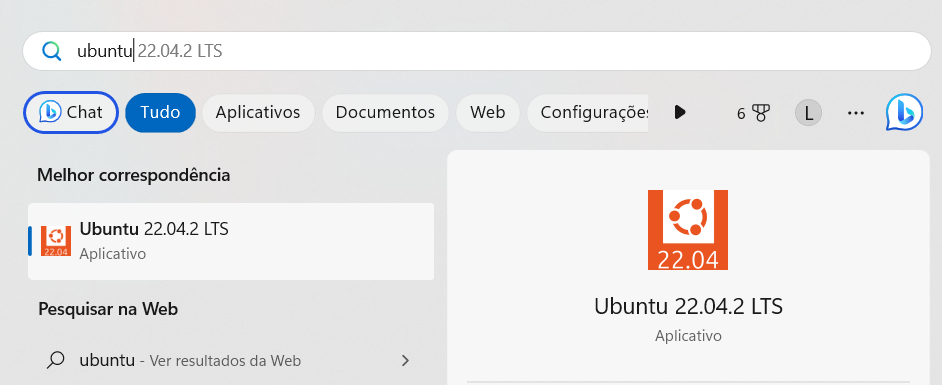

- Conta no [**Github**](https://docs.aws.amazon.com/codedeploy/latest/userguide/tutorials-github-create-github-account.html) (+ [token de autorização](https://docs.github.com/en/authentication/keeping-your-account-and-data-secure/creating-a-personal-access-token), _se necessário_, com permissão de criação e atualização de repositórios), caso você desejar subir e deixar o projeto registrado.

- [Node.js instalado na máquina.](https://www.digitalocean.com/community/tutorials/how-to-install-node-js-on-ubuntu-20-04) (no caso, instalamos diretamente dentro do Ubuntu 22.04.2 LTS via terminal).

- [Conta na AWS com usuário com permissões de Administrador.](https://docs.aws.amazon.com/pt_br/lex/latest/dg/gs-account.html)

- Terraform instalado na máquina (no caso, instalamos diretamente dentro do Ubuntu 22.04.2 LTS).

- [Visual Studio Code (VS Code).](https://code.visualstudio.com)

### 2. Instalação do Terraform


A primeira etapa para desenvolvermos essa aplicação é instalar o Terraform na máquina. O Terraform é uma **ferramenta de gerenciamento de infraestrutura como código (IaC)** desenvolvida pela HashiCorp. Ele permite que os usuários definam, configurem e provisionem infraestruturas de forma automatizada e reprodutível, usando uma linguagem declarativa e uma sintaxe simples.
Com o Terraform, é possível criar e gerenciar recursos em diferentes provedores de nuvem, como AWS, Google Cloud, Azure e outros, bem como em plataformas de infraestrutura, como Kubernetes, Docker e OpenStack.
Em resumo, **o Terraform é uma ferramenta importante para automatizar e gerenciar infraestruturas de nuvem e outras plataformas de infraestrutura, tornando a gestão de infraestrutura escalável, segura e repetível.**

Caso você não possua o Terraform no seu computador, é necessário baixar e instalar de acordo com o tutorial presente [neste link (Windows)](https://www.youtube.com/watch?v=bSrV1Dr8py8) ou diretamente [neste link (Ubuntu/Linux)](https://developer.hashicorp.com/terraform/downloads).

### 3. Utilização

Após a instalação do Terraform na máquina, já é possível rodar a infraestrutura desenvolvida ou criar sua própria infraestrutura com base em tudo que está sendo apresentado aqui.

O primeiro passo é clonar este repositório em uma pasta dentro do seu computador. _Caso não saiba como clonar um repositório na sua máquina local, acesse o tutorial presente [neste link](https://docs.github.com/pt/repositories/creating-and-managing-repositories/cloning-a-repository) ou faça o download do respositório e descompacte o arquivo .zip no local desejado._

!!! Tip
***Caso você desejar criar a infraestrutura do zero, segui e sugiro a seguinte estrutura de pastas:***

```
Cloud-Project
│
│
└───hello
│   |---function.js
│
└───s3
|   │---function.js
│
│───Terraform
│   |---api-gateway.tf
│   |
│   |---hello-api-gateway.tf
│   |
│   |---hello-lamba.tf
│   |
│   |---lambda-s3-bucket.tf
│   |
│   |---provider.tf
│   |
│   |---s3-lambda.tf
│   |
│   |---test-bucket.tf
│   |
│   |---terraform.sh


```

Independentemente se você escolheu clonar o repositório com a infraestrutura original ou se tiver escolhido criar do zero, **lembre-se que tudo deve ser feito dentro do prompt de comando do Ubuntu 22.04.2 LTS** caso deseje chegar nos mesmos resultados apresentados aqui sem grandes riscos de problemas.

---

<!-- !!! info
Essas duas partes são obrigatórias no tutorial:

    - Nome de vocês
    - Começando
    - Motivação -->

## Credenciais AWS no Terraform

Antes de darmos início, é necessário cadastrar suas credenciais AWS na sua máquina. Temos várias formas de fazer isso, porém iremos optar pela alternativa que eu considero mais segura para quem está iniciando na AWS (incluindo eu mesmo): cadastrar diretamente via terminal.
Você deve possuir um .csv com a chave de acesso (Secret Key) e a chave secreta (Secret Access Key) de acesso da sua conta, precisaremos dessas informações agora.
Dentro do terminal Ubuntu, insira os comandos:

```
aws configure
```

Após o comando acima, serão solicitadas as suas chaves de acesso. Coloque-as no terminal como solicitado e bora trabalhar!

## Criando uma função Lambda no Terraform

O primeiro passo será criarmos uma função lambda que, futuramente, será integrada com o AWS API Gateway.
Inicialmente, começaremos com uma função simples baseada em **NodeJS** sem nenhuma dependência.

<!--
!!! note
Bloco de destaque de texto, pode ser:

    - note, example, warning, info, tip, danger

!!! example "Faça assim"
É possível editar o título desses blocos

    !!! warning
        Isso também é possível de ser feito, mas
        use com parcimonia.

??? info
Também da para esconder o texto, usar para coisas
muito grandes, ou exemplos de códigos.

    ```txt
    ...


    oi!
    ```

- **Esse é um texto em destaque**
- ==Pode fazer isso também==

Usar emojis da lista:

:two_hearts: - https://github.com/caiyongji/emoji-list -->

=== "**index.js**"

```js linenums="1"
exports.handler = async (event) => {
  console.log("Event: ", event);
  let responseMessage = "Hello, World!";

  if (event.queryStringParameters && event.queryStringParameters["Name"]) {
    responseMessage = "Hello, " + event.queryStringParameters["Name"] + "!";
  }

  return response;
};
```

Ao invocar essa função com uma consulta de URL e com o parâmetro Name definido, ela retornará "Hello, Name!".

=== "**index.js**"

```js linenums="1"
exports.handler = async (event) => {
  console.log("Event: ", event);
  let responseMessage = "Hello, World!";

  if (event.queryStringParameters && event.queryStringParameters["Name"]) {
    responseMessage = "Hello, " + event.queryStringParameters["Name"] + "!";
  }

+  if (event.httpMethod === "POST") {
+    const body = JSON.parse(event.body);
+    responseMessage = "Hello, " + body.name + "!";
+  }

+  const response = {
+    statusCode: 200,
+    headers: {
+      "Content-Type": "application/json",
+    },
+    body: JSON.stringify({
+      message: responseMessage,
+    }),
+  };

  return response;
};
```

Também será verificado o método **HTTP GET e POST** para que seja verificada a resposta padrão. Foi especificado o **código de status '200',
tipo de conteúdo e a mensagem** para ser retornada ao chamador.

## Criando o provider

Agora que nossa handler já está pronta, começaremos a trabalhar em alguns elementos do nosso Terraform.
Criaremos os arquivos **_.tf_** dentro de uma pasta intitulada (por motivos intuitivos, claro) como "terraform".

Começaremos criando o arquivo "provider.tf", em que serão declaradas as restrições de versão (região da AWS, por exemplo) para os diferentes provedores AWS, versões de Teraform e afins.

Isso é feito apenas para que, caso alguém pegue esse projeto no futuro e rode em outra versão de Terraform ou com configurações diferentes das que foram aqui padronizadas, o projeto não funcione.

=== "**terraform/provider.tf**"

```tf linenums="1"
terraform {
    required_providers {
    aws = {
        source = "hashicorp/aws"
        version = "~> 4.21.0"
        }
    # Aqui dentro poderíamos também ter estabelecido outras restrições
    # de versão, mas optei por deixar o mais simples possível.
    }

required_version = "~> 1.0"
}

provider "aws" {
    region = "us-east-1" # Região Northern Virginia
}
```

## Bucket do S3

Agora nós construiremos uma função com todas as dependências, empacotaremos como um arquivo **_zip_** para que, assim,
consigamos subir num bucket do S3. Ou seja, quando criamos o lambda, apontamos para esse objeto de arquvo zip no bucket S3.

Como os nomes dos buckets do S3 devem ser **únicos e exclusivos** no mundo inteiro, podemos utilizar um gerador aleatório para
nos ajudar a nomear nosso bucket S3.

=== "**terraform/lambda-bucket.tf**"

```tf linenums="1"
resource "random_pet" "lambda_bucket_name" {
prefix = "lambda"
length = 2
}

```

Em seguida, vamos criar o próprio bucket do S3 com o nome gerado.

=== "**terraform/lambda-bucket.tf**"

```tf linenums="1"

resource "random_pet" "lambda_bucket_name" {
  prefix = "lambda"
  length = 2
}

+resource "aws_s3_bucket" "lambda_bucket" {
+  bucket        = random_pet.lambda_bucket_name.id
+  force_destroy = true
+}


```

Por padrão, deixaremos todo o acesso público ao bucket bloqueado.

=== "**terraform/lambda-bucket.tf**"

```tf linenums="1"

resource "random_pet" "lambda_bucket_name" {
  prefix = "lambda"
  length = 2
}

resource "aws_s3_bucket" "lambda_bucket" {
  bucket        = random_pet.lambda_bucket_name.id
  force_destroy = true
}

+resource "aws_s3_bucket_public_access_block" "lambda_bucket" {
+  bucket = aws_s3_bucket.lambda_bucket.id

+  block_public_acls       = true
+  block_public_policy     = true
+  ignore_public_acls      = true
+  restrict_public_buckets = true
+}

```

## IAM e Policies

Agora criaremos o código Terraform do lambda. Lembrando que o lambda exigirá acesso a outros serviços da AWS (como o CloudWatch, para gravar logs) e, no nosso caso, concederemos acesso ao bucket do S3 para que seja possível a leitura de um arquivo.

Para isso, precisamos criar uma função do IAM e permitir que o lambda a use.

=== "**terraform/hello-lambda.tf**"

```tf linenums="1"

resource "aws_iam_role" "hello_lambda_exec" {
  name = "hello-lambda"

  assume_role_policy = <<POLICY
{
  "Version": "2012-10-17",
  "Statement": [
    {
      "Effect": "Allow",
      "Principal": {
        "Service": "lambda.amazonaws.com"
      },
      "Action": "sts:AssumeRole"
    }
  ]
}
POLICY
}

resource "aws_iam_role_policy_attachment" "hello_lambda_policy" {
  role       = aws_iam_role.hello_lambda_exec.name
  policy_arn = "arn:aws:iam::aws:policy/service-role/AWSLambdaBasicExecutionRole"
}

```

## Criando uma função Lambda

O próximo recurso será criar a função lambda, a qual chamaremos de "hello". Em seguida especificaremos o nome do intervalo onde
armazenaremos todos os lambdas. E nosso key pointing irá apontar para um arquivo zip com uma função.

O hash do código-fonte foi adicionado para reimplementar a função caso seja alterado/atualizado algo no código-fonte.
Se o hash do arquivo zip for diferente, a reimplantação do lambda será forçada.

=== "**terraform/hello-lambda.tf**"

```tf linenums="1"

resource "aws_iam_role" "hello_lambda_exec" {
  name = "hello-lambda"

  assume_role_policy = <<POLICY
{
  "Version": "2012-10-17",
  "Statement": [
    {
      "Effect": "Allow",
      "Principal": {
        "Service": "lambda.amazonaws.com"
      },
      "Action": "sts:AssumeRole"
    }
  ]
}
POLICY
}

resource "aws_iam_role_policy_attachment" "hello_lambda_policy" {
  role       = aws_iam_role.hello_lambda_exec.name
  policy_arn = "arn:aws:iam::aws:policy/service-role/AWSLambdaBasicExecutionRole"
}

+resource "aws_lambda_function" "hello" {
+  function_name = "hello"

+  s3_bucket = aws_s3_bucket.lambda_bucket.id
+  s3_key    = aws_s3_object.lambda_hello.key

+  runtime = "nodejs16.x"
+  handler = "function.handler"

+  source_code_hash = data.archive_file.lambda_hello.output_base64sha256

+  role = aws_iam_role.hello_lambda_exec.arn
+}

```

## Criando o CloudWatch

Para depurar, criamos um grupo de logs do CloudWatch que conseguisse armazenar todas as instruções e erros do console.log na função.
Definimos a retenção para 30 dias, porém poderia ser uma quantidade maior ou menor também, a depender das intenções de quem está
desenvolvendo a infraestrutura (além dessas decisões poderem afetar o custo de execução do lambda).

=== "**terraform/hello-lambda.tf**"

```tf linenums="1"
resource "aws_iam_role" "hello_lambda_exec" {
  name = "hello-lambda"

  assume_role_policy = <<POLICY
{
  "Version": "2012-10-17",
  "Statement": [
    {
      "Effect": "Allow",
      "Principal": {
        "Service": "lambda.amazonaws.com"
      },
      "Action": "sts:AssumeRole"
    }
  ]
}
POLICY
}

resource "aws_iam_role_policy_attachment" "hello_lambda_policy" {
  role       = aws_iam_role.hello_lambda_exec.name
  policy_arn = "arn:aws:iam::aws:policy/service-role/AWSLambdaBasicExecutionRole"
}

resource "aws_lambda_function" "hello" {
  function_name = "hello"

  s3_bucket = aws_s3_bucket.lambda_bucket.id
  s3_key    = aws_s3_object.lambda_hello.key

  runtime = "nodejs16.x"
  handler = "function.handler"

  source_code_hash = data.archive_file.lambda_hello.output_base64sha256

  role = aws_iam_role.hello_lambda_exec.arn
}

+resource "aws_cloudwatch_log_group" "hello" {
+  name = "/aws/lambda/${aws_lambda_function.hello.function_name}"

+  retention_in_days = 30
+}

```

Em seguida, adicionaremos o recurso que empacota o lambda como um arquivo zip.

=== "**terraform/hello-lambda.tf**"

```tf linenums="1"
resource "aws_iam_role" "hello_lambda_exec" {
  name = "hello-lambda"

  assume_role_policy = <<POLICY
{
  "Version": "2012-10-17",
  "Statement": [
    {
      "Effect": "Allow",
      "Principal": {
        "Service": "lambda.amazonaws.com"
      },
      "Action": "sts:AssumeRole"
    }
  ]
}
POLICY
}

resource "aws_iam_role_policy_attachment" "hello_lambda_policy" {
  role       = aws_iam_role.hello_lambda_exec.name
  policy_arn = "arn:aws:iam::aws:policy/service-role/AWSLambdaBasicExecutionRole"
}

resource "aws_lambda_function" "hello" {
  function_name = "hello"

  s3_bucket = aws_s3_bucket.lambda_bucket.id
  s3_key    = aws_s3_object.lambda_hello.key

  runtime = "nodejs16.x"
  handler = "function.handler"

  source_code_hash = data.archive_file.lambda_hello.output_base64sha256

  role = aws_iam_role.hello_lambda_exec.arn
}

resource "aws_cloudwatch_log_group" "hello" {
  name = "/aws/lambda/${aws_lambda_function.hello.function_name}"

  retention_in_days = 14
}

+data "archive_file" "lambda_hello" {
+  type = "zip"

+  source_dir  = "../${path.module}/hello"
+  output_path = "../${path.module}/hello.zip"
+}

```

Nosso último componente visa obter o arquivo zip e carregar no bucket do S3.

=== "**terraform/hello-lambda.tf**"

```tf linenums="1"
resource "aws_iam_role" "hello_lambda_exec" {
  name = "hello-lambda"

  assume_role_policy = <<POLICY
{
  "Version": "2012-10-17",
  "Statement": [
    {
      "Effect": "Allow",
      "Principal": {
        "Service": "lambda.amazonaws.com"
      },
      "Action": "sts:AssumeRole"
    }
  ]
}
POLICY
}

resource "aws_iam_role_policy_attachment" "hello_lambda_policy" {
  role       = aws_iam_role.hello_lambda_exec.name
  policy_arn = "arn:aws:iam::aws:policy/service-role/AWSLambdaBasicExecutionRole"
}

resource "aws_lambda_function" "hello" {
  function_name = "hello"

  s3_bucket = aws_s3_bucket.lambda_bucket.id
  s3_key    = aws_s3_object.lambda_hello.key

  runtime = "nodejs16.x"
  handler = "function.handler"

  source_code_hash = data.archive_file.lambda_hello.output_base64sha256

  role = aws_iam_role.hello_lambda_exec.arn
}

resource "aws_cloudwatch_log_group" "hello" {
  name = "/aws/lambda/${aws_lambda_function.hello.function_name}"

  retention_in_days = 30
}

data "archive_file" "lambda_hello" {
  type = "zip"

  source_dir  = "../${path.module}/hello"
  output_path = "../${path.module}/hello.zip"
}

+resource "aws_s3_object" "lambda_hello" {
+  bucket = aws_s3_bucket.lambda_bucket.id

+  key    = "hello.zip"
+  source = data.archive_file.lambda_hello.output_path

+  etag = filemd5(data.archive_file.lambda_hello.output_path)
+}

```

## Inicializando o Terraform

Com os passos feitos até aqui já conseguimos inicializar o terraform:

```tf
terraform init
```

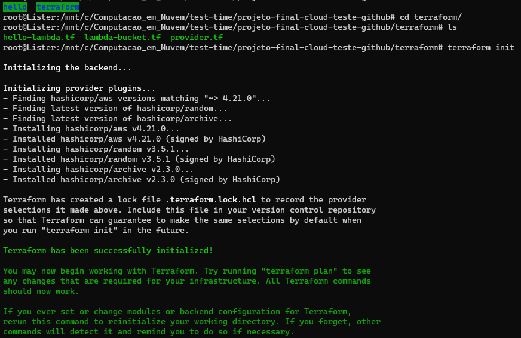

Agora aplicamos as alterações:

```tf
terraform apply
```
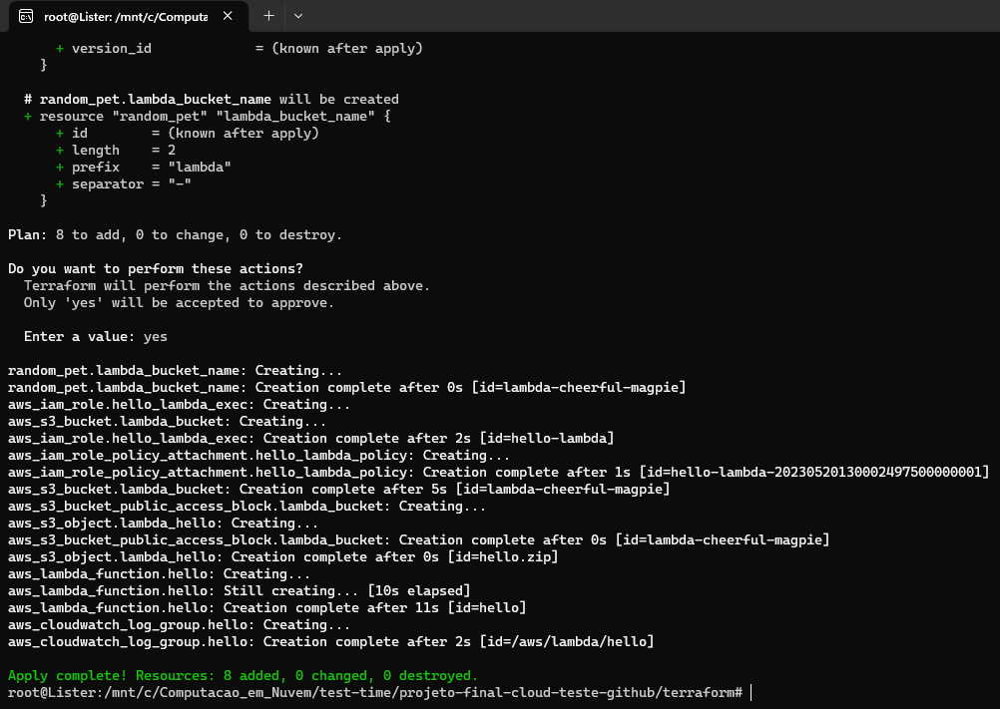

> :warning: **Dica visual**

> Quando o terraform concluir suas etapas até aqui, podemos entrar no dashboard da AWS e encontrar, dentre outras coisas, um bucket S3 recém-criado com um nome definido por meio de um gerador de animais de estimação aleatório.
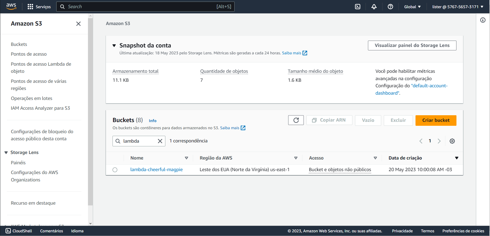
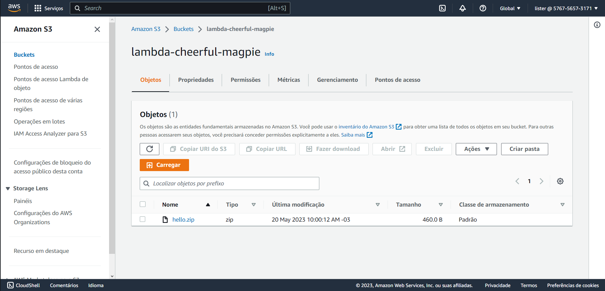

---

**Para abstrair:**

Note que dentro do bucket são armazenadas funções lambdas dentro de um **zip.**

Quando entramos na dashboard da **AWS CloudWatch** também conseguimos ver o grupo de logs criado.

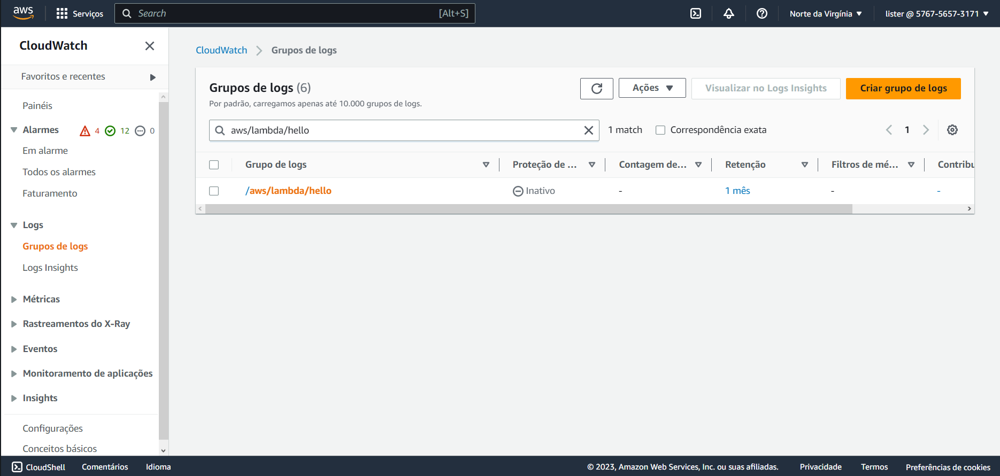

No dashboard do **AWS Lambda** conseguimos ver a função lambda empacotada como um zip.

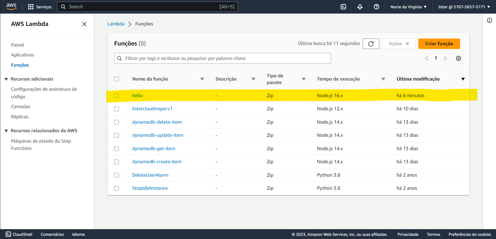

---

Vamos agora invocar a função com o comando **_aws lambda invoke_**.

Lembre-se de especificar ou conferir se o nome da região, função e arquivo estão corretos para registrar a resposta da função.

```tf
aws lambda invoke --region=us-east-1 --function-name=hello response.json
```
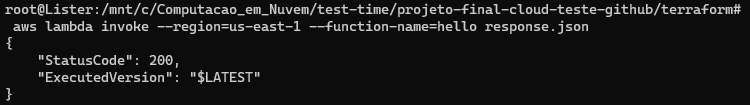
Ao printarmos a resposta, é esperado um retorno **"Olá, Avelino!"**

```tf
cat response.json
```
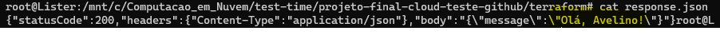

## Criando o API Gateway

A próxima estapa será criar o API Gateway e integrá-lo ao nosso lambda.

Utilizaremos a versão 2 do API Gateway.

=== "**terraform/api-gateway.tf**"

```tf linenums="1"
resource "aws_apigatewayv2_api" "main" {
  name          = "main"
  protocol_type = "HTTP"
}

resource "aws_apigatewayv2_stage" "dev" {
  api_id = aws_apigatewayv2_api.main.id

  name        = "dev"
  auto_deploy = true

  access_log_settings {
    destination_arn = aws_cloudwatch_log_group.main_api_gw.arn

    format = jsonencode({
      requestId               = "$context.requestId"
      sourceIp                = "$context.identity.sourceIp"
      requestTime             = "$context.requestTime"
      protocol                = "$context.protocol"
      httpMethod              = "$context.httpMethod"
      resourcePath            = "$context.resourcePath"
      routeKey                = "$context.routeKey"
      status                  = "$context.status"
      responseLength          = "$context.responseLength"
      integrationErrorMessage = "$context.integrationErrorMessage"
      }
    )
  }
}

resource "aws_cloudwatch_log_group" "main_api_gw" {
  name = "/aws/api-gw/${aws_apigatewayv2_api.main.name}"

  retention_in_days = 30
}

```

## Integrando o API Gateway com o Lambda

No próximo arquivo Terraform, integraremos o API Gateway com o hello lambda. Primeiramente apontaremos para o ID do API Gateway que acabamos de criar. Em seguida utilizaremos PROXYS AWS e solicitações POST para encaminhar solicitações do API Gateway para o Lambda

=== "**terraform/hello-api-gateway.tf**"

```tf linenums="1"
resource "aws_apigatewayv2_integration" "lambda_hello" {
api_id = aws_apigatewayv2_api.main.id

integration_uri = aws_lambda_function.hello.invoke_arn
integration_type = "AWS_PROXY"
integration_method = "POST"
}

```

Podemos especificar qual tipo de solicitações queremos passar para o lambda, por exemplo: GET ou POST, como abaixo:

=== "**terraform/hello-api-gateway.tf**"

```tf linenums="1"
resource "aws_apigatewayv2_integration" "lambda_hello" {
api_id = aws_apigatewayv2_api.main.id

integration_uri = aws_lambda_function.hello.invoke_arn
integration_type = "AWS_PROXY"
integration_method = "POST"
}

+resource "aws_apigatewayv2_route" "get_hello" {
+api_id = aws_apigatewayv2_api.main.id

+route_key = "GET /hello"
+target = "integrations/${aws_apigatewayv2_integration.lambda_hello.id}"
+}

+resource "aws_apigatewayv2_route" "post_hello" {
+api_id = aws_apigatewayv2_api.main.id

+route_key = "POST /hello"
+target = "integrations/${aws_apigatewayv2_integration.lambda_hello.id}"
+}

```

Note que em ambos os exemplos é necessário especificar um destino para ser o nosso lambda.
Também precisamos conceder permissões ao API Gateway para invocar nossa função lambda:

=== "**terraform/hello-api-gateway.tf**"

```tf linenums="1"
resource "aws_apigatewayv2_integration" "lambda_hello" {
  api_id = aws_apigatewayv2_api.main.id

  integration_uri    = aws_lambda_function.hello.invoke_arn
  integration_type   = "AWS_PROXY"
  integration_method = "POST"
}

resource "aws_apigatewayv2_route" "get_hello" {
  api_id = aws_apigatewayv2_api.main.id

  route_key = "GET /hello"
  target    = "integrations/${aws_apigatewayv2_integration.lambda_hello.id}"
}

resource "aws_apigatewayv2_route" "post_hello" {
  api_id = aws_apigatewayv2_api.main.id

  route_key = "POST /hello"
  target    = "integrations/${aws_apigatewayv2_integration.lambda_hello.id}"
}

+resource "aws_lambda_permission" "api_gw" {
+  statement_id  = "AllowExecutionFromAPIGateway"
+  action        = "lambda:InvokeFunction"
+  function_name = aws_lambda_function.hello.function_name
+  principal     = "apigateway.amazonaws.com"

+  source_arn = "${aws_apigatewayv2_api.main.execution_arn}/*/*"
+}

```

## Invocando o Lambda

Por fim, vamos imprimir no console o URL que podemos usar para invocar o lambda.

=== "**terraform/hello-api-gateway.tf**"

```tf linenums="1"
resource "aws_apigatewayv2_integration" "lambda_hello" {
  api_id = aws_apigatewayv2_api.main.id

  integration_uri    = aws_lambda_function.hello.invoke_arn
  integration_type   = "AWS_PROXY"
  integration_method = "POST"
}

resource "aws_apigatewayv2_route" "get_hello" {
  api_id = aws_apigatewayv2_api.main.id

  route_key = "GET /hello"
  target    = "integrations/${aws_apigatewayv2_integration.lambda_hello.id}"
}

resource "aws_apigatewayv2_route" "post_hello" {
  api_id = aws_apigatewayv2_api.main.id

  route_key = "POST /hello"
  target    = "integrations/${aws_apigatewayv2_integration.lambda_hello.id}"
}

resource "aws_lambda_permission" "api_gw" {
  statement_id  = "AllowExecutionFromAPIGateway"
  action        = "lambda:InvokeFunction"
  function_name = aws_lambda_function.hello.function_name
  principal     = "apigateway.amazonaws.com"

  source_arn = "${aws_apigatewayv2_api.main.execution_arn}/*/*"
}

+output "hello_base_url" {
+  value = aws_apigatewayv2_stage.dev.invoke_url
+}

```


No terminal, daremos um apply no terraform.

```tf linenums="1"
terraform apply
```
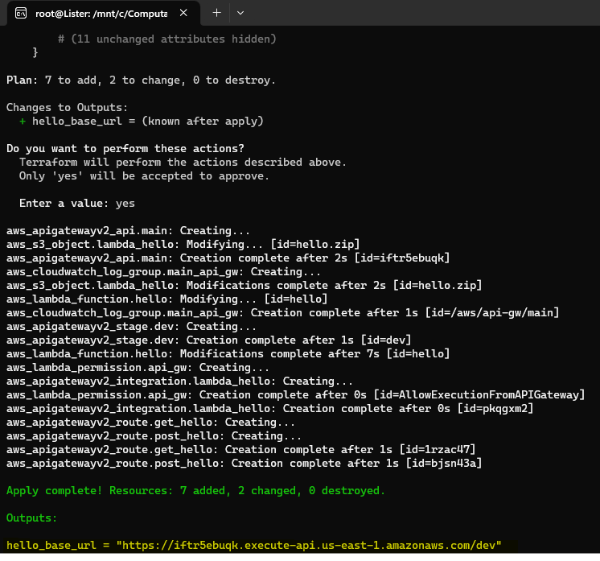

> :warning: **Dica visual**

> _Se entrarmos no dashboard do **API Gateway**, podemos ver nosso estágio de desenvolvimento "dev" criado e, em "rotas", conseguimos encontrar os métodos ***GET e POST.***_
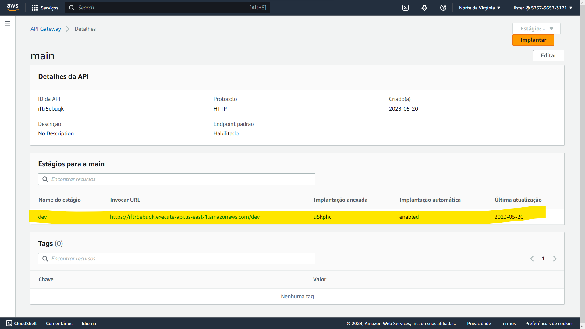
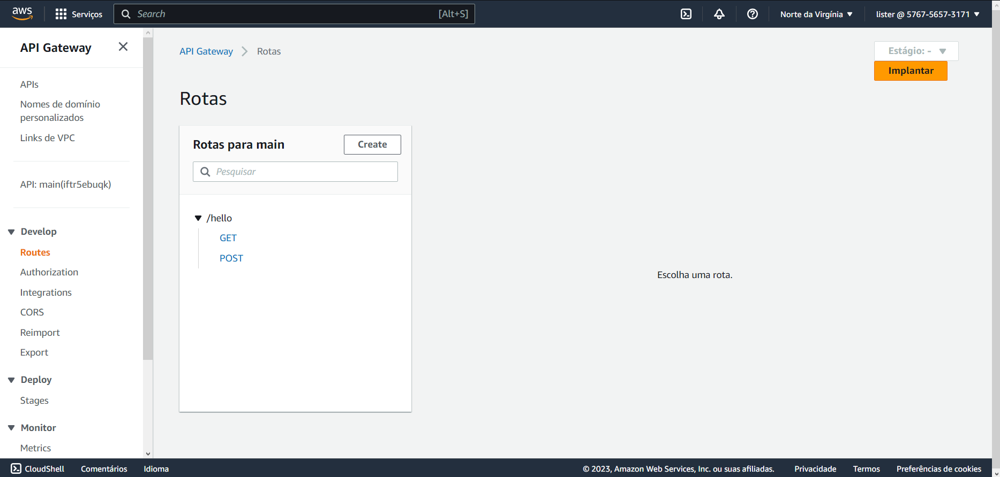

Até essa etapa, **se você estiver seguindo a risca minha forma de fazer esse handout**, é esperada que a estrutura do seu código esteja como na imagem abaixo:

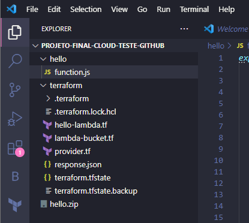

## Hora de testar

Vamos agora testar o método HTTP GET.
A função deve analisá-lo e retornar a mensagem **"Olá, _+ parâmetro de URL_"**

```tf
curl "https://<id>.execute-api.us-east-1.amazonaws.com/dev/hello?Name=InsperUniversity"
               /\
               ||
    Substitua <id> pelo seu id
```
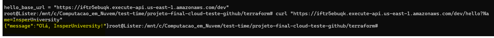

Também testaremos o método POST. Nesse caso, fornecemos um payload como um objeto json para o terminal e veremos que funciona também.

```tf
curl -X POST \
-H "Content-Type: application/json" \
-d '{"name":"Insper"}' \
"https://<id>.execute-api.us-east-1.amazonaws.com/dev/hello"
          /\
          ||
Substitua <id> pelo seu id

```
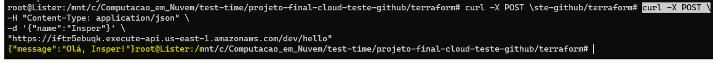

> :warning: **Dica visual**

> _Se entrarmos no dashboard do **CloudWatch**, conseguiremos ver os logs de acesso registrados para nossas solicitações._
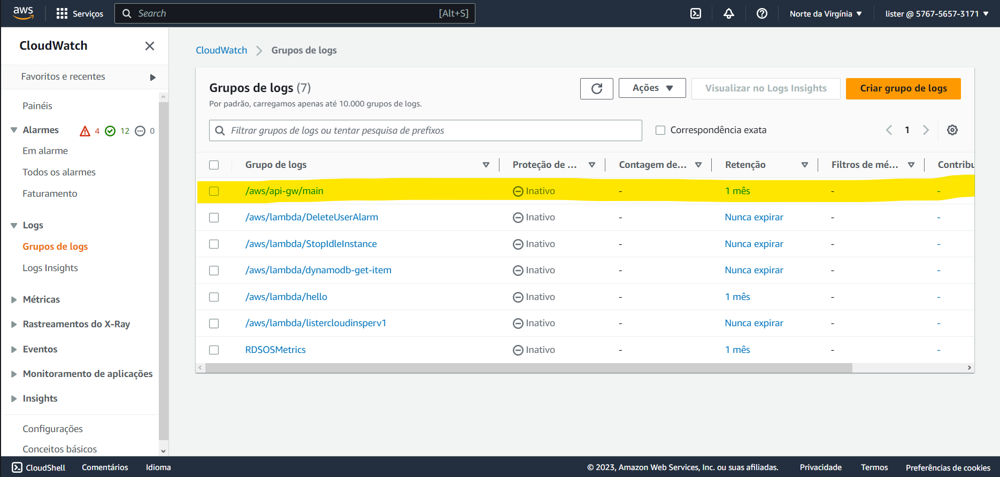
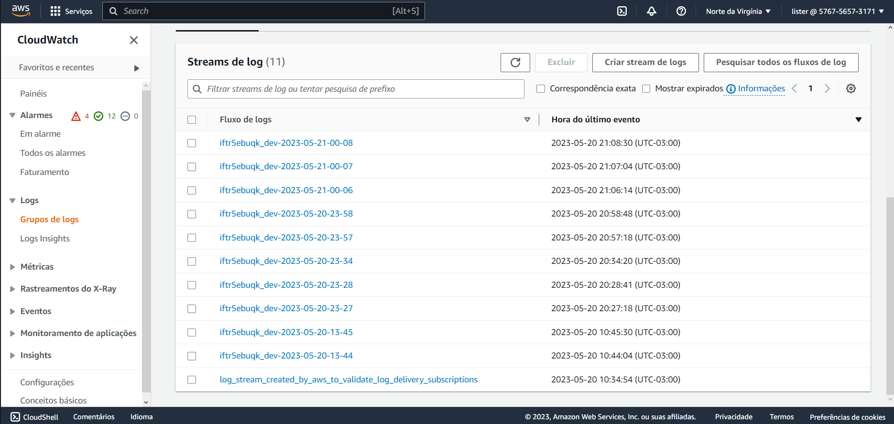

## Criando função lambda com dependências externas e acesso ao bucket S3

Vamos agora criar outra função lambda com dependências externas e que garanta acesso para a leitura de um arquivo em um bucket S3.

Novamente, utilizaremos o random pet para nos auxiliar com um nome aleatório e único para nosso bucket do S3 e dicionaremos o prefixo "test" (o que também auxilia na identificação do bucket).

Para esse bucket também deixaremos o acesso público desativado.


=== "**terraform/test-bucket.tf**"

```tf linenums="1"
resource "random_pet" "test_bucket_name" {
  prefix = "test"
  length = 2
}

resource "aws_s3_bucket" "test" {
  bucket        = random_pet.test_bucket_name.id
  force_destroy = true
}

resource "aws_s3_bucket_public_access_block" "test" {
  bucket = aws_s3_bucket.test.id

  block_public_acls       = true
  block_public_policy     = true
  ignore_public_acls      = true
  restrict_public_buckets = true
}

```

Nós também podemos criar um objeto no S3 bucket utilizando terraform e o jsoncode build-in. Isso irá converter para um objeto json válido.

=== "**terraform/test-bucket.tf**"

```tf linenums="1"
resource "random_pet" "test_bucket_name" {
  prefix = "test"
  length = 2
}

resource "aws_s3_bucket" "test" {
  bucket        = random_pet.test_bucket_name.id
  force_destroy = true
}

resource "aws_s3_bucket_public_access_block" "test" {
  bucket = aws_s3_bucket.test.id

  block_public_acls       = true
  block_public_policy     = true
  ignore_public_acls      = true
  restrict_public_buckets = true
}

+resource "aws_s3_object" "test" {
+  bucket = aws_s3_bucket.test.id

+  key     = "hello.json"
+  content = jsonencode({ name = "S3" })
+}

+output "test_s3_bucket" {
+  value = random_pet.test_bucket_name.id
+}

```

Agora iremos criar uma nova função lambda em uma nova pasta s3.

Começaremos importando o aws-sdk e inicializando o objeto javascript.

Essa função irá nos retornar o conteúdo do objeto.

=== "**s3/function.js**"

```js linenums="1"
const aws = require("aws-sdk");

const s3 = new aws.S3({ apiVersion: "2006-03-01" });

exports.handler = async (event, context) => {
  console.log("Received event:", JSON.stringify(event, null, 2));

  const bucket = event.bucket;
  const object = event.object;
  const key = decodeURIComponent(object.replace(/\+/g, " "));

  const params = {
    Bucket: bucket,
    Key: key,
  };
  try {
    const { Body } = await s3.getObject(params).promise();
    const content = Body.toString("utf-8");
    return content + " Yeah, I am working, Avelinux :) !!";
  } catch (err) {
    console.log(err);
    const message = `Error getting object ${key} from bucket ${bucket}.`;
    console.log(message);
    throw new Error(message);
  }
};
```

Dentro do diretório da recém-criada pasta "s3", devemos inicializar o projeto nodejs com o seguinte comando:

=== "**/s3**"

```tf
npm init
```

Esse comando irá gerar arquivos _package.json_ com dependências.
***Não há necessidade de preencher as informações solicitadas, basta teclar "enter" para cada info solicitada.***

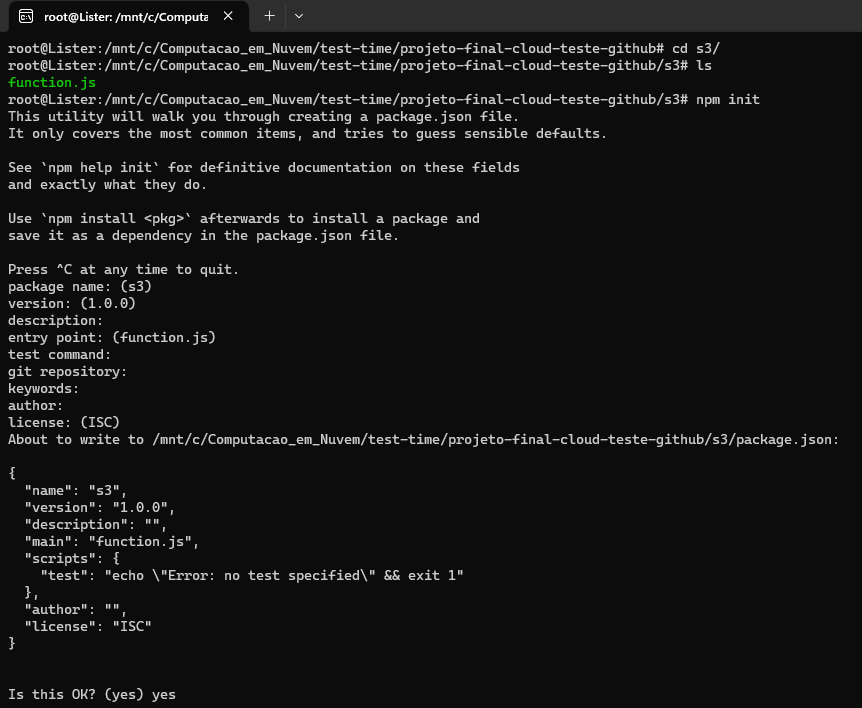

Em seguida, iremos instalar o módulo [aws-sdk](https://aws.amazon.com/pt/sdk-for-javascript/):


=== "**/s3**"

```tf
npm install aws-sdk
```
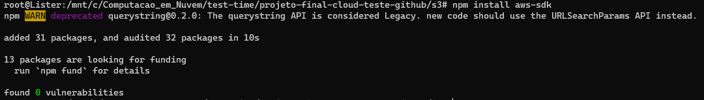

Agora retornaremos à pasta "Terraform" e iremos criar nossas políticas de acesso.

=== "**terraform/s3-lambda.tf**"

```tf linenums="1"
resource "aws_iam_role" "s3_lambda_exec" {
  name = "s3-lambda"

  assume_role_policy = <<POLICY
{
  "Version": "2012-10-17",
  "Statement": [
    {
      "Effect": "Allow",
      "Principal": {
        "Service": "lambda.amazonaws.com"
      },
      "Action": "sts:AssumeRole"
    }
  ]
}
POLICY
}

resource "aws_iam_role_policy_attachment" "s3_lambda_policy" {
  role       = aws_iam_role.s3_lambda_exec.name
  policy_arn = "arn:aws:iam::aws:policy/service-role/AWSLambdaBasicExecutionRole"
}

resource "aws_iam_policy" "test_s3_bucket_access" {
  name        = "TestS3BucketAccess"

  policy = jsonencode({
    Version = "2012-10-17"
    Statement = [
      {
        Action = [
          "s3:GetObject", #Permitir obter um objeto do bucket
        ]
        Effect   = "Allow"
        Resource = "arn:aws:s3:::${aws_s3_bucket.test.id}/*"
      },
    ]
  })
}

# Política para acessar o novo bucket do s3:

resource "aws_iam_role_policy_attachment" "s3_lambda_test_s3_bucket_access" {
  role       = aws_iam_role.s3_lambda_exec.name
  policy_arn = aws_iam_policy.test_s3_bucket_access.arn
}

# Aqui teremos apoio na extração do aquivo zip da função

resource "aws_lambda_function" "s3" {
  function_name = "s3"

  s3_bucket = aws_s3_bucket.lambda_bucket.id
  s3_key    = aws_s3_object.lambda_s3.key

  runtime = "nodejs16.x"
  handler = "function.handler"

  source_code_hash = data.archive_file.lambda_s3.output_base64sha256

  role = aws_iam_role.s3_lambda_exec.arn
}

# Novo grupo de logs do CloudWatch para a função:

resource "aws_cloudwatch_log_group" "s3" {
  name = "/aws/lambda/${aws_lambda_function.s3.function_name}"

  retention_in_days = 14
}


# "Compacte a função e carregue o zip para o bucket s3:"

data "archive_file" "lambda_s3" {
  type = "zip"

  source_dir  = "../${path.module}/s3"
  output_path = "../${path.module}/s3.zip"
}

resource "aws_s3_object" "lambda_s3" {
  bucket = aws_s3_bucket.lambda_bucket.id

  key    = "s3.zip"
  source = data.archive_file.lambda_s3.output_path

  source_hash = filemd5(data.archive_file.lambda_s3.output_path)
}
```

Vamos agora deployar diretamente na máquina local. Para isso será necessário criar um simples script wrapper no Terraform:

=== "**terraform/terraform.sh**"

```sh linenums="1"
#!/bin/sh

set -e

cd ../s3
npm ci

cd ../terraform
terraform apply

```


(No terminal, diretório **/terraform**) Vamos fazer o script se tornar executável:

```sh
chmod +x terraform.sh

```

Em seguida podemos rodar:

```sh
./terraform.sh

```


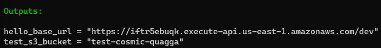


Note que, ao rodarmos o comando acima, ele automaticamente rodará nosso terraform.sh que possui um "terraform apply", **aplicando imediatamente as alterações que fizemos**, sem que tenhamos que utilizar novamente o comando _"terraform apply"_ no terminal.

No terminal receberemos de volta o nome do nosso recém-criado bucket do s3. Podemos invocar essa função s3 com o nome do bucket + nosso objeto para ver se o lambda conseguirá obter o objeto do bucket.

```sh
aws lambda invoke \
--region=us-east-1 \
--function-name=s3 \
--cli-binary-format raw-in-base64-out \
--payload '{"bucket":"test-<your>-<name>","object":"hello.json"}' \
response.json
                             /\
                             ||
      Substitua test-<your>-<name> pelo nome do seu bucket

```

Por fim, rode no terminal o seguinte comando:

```sh
cat responde.json

```

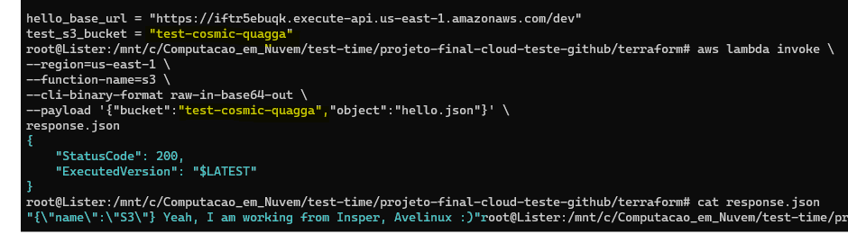

Se você receber como retorno **_Yeah, I am working, Avelinux :)_**, parabéns, você concluiu sua aplicação e ela está funcionando!


Agora que você já viu todo o ambiente da sua IaaC (Infrastructure as a Code) sendo criado e funcionando, **chegou a hora de destruí-lo!**

Utilize o comando a seguir no seu terminal para destruir a infraestrutura:
```sh
terraform destroy
```
O resultado final deve ser algo parecido com a imagem a seguir:

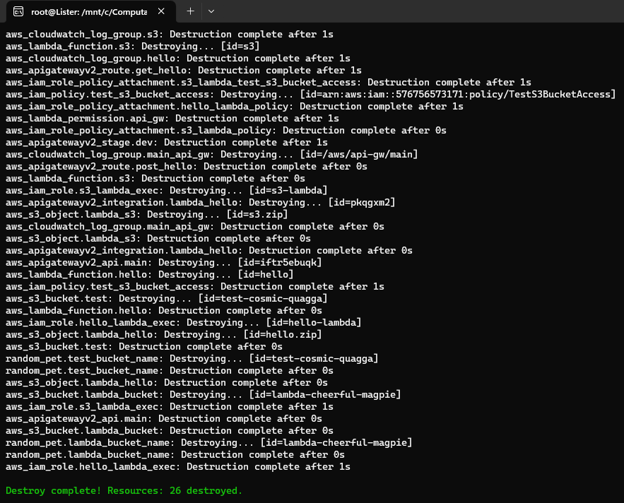

> :warning: **Dica visual**

> Entre no dashboard da AWS e veja que todos os recursos sumiram: eles foram destruídos!

### Referências

Foram utilizadas dezenas de referências à construção do conhecimento aplicado aqui neste material. Todo o conteúdo utilizado para a construção do aprendizado pode ser conferido abaixo:

1. [Publish/Subscribe on AWS with Terraform, .NET 6 and serverless](https://www.youtube.com/watch?v=k3-gE4wLibQ)
2. [CodePossibility thumbnail generation lambda](https://github.com/CodePossibility/thumbnail_generation_lambda)
3. [Application Integration Patterns](https://github.com/jeastham1993/application-integration-patterns/tree/main)
4. [AWS: Serverless web application](https://www.youtube.com/watch?v=SgvkU1yNuGM)
5. [Build Lambda based REST API](https://www.youtube.com/watch?v=50rBFasH3OE)
6. [Terraform: Serverless (Node.js) REST API Tutorial - 1](https://www.youtube.com/watch?v=m2DRYu6P4Ik)
7. [Terraform: Serverless (Node.js) REST API Tutorial - 2](https://www.youtube.com/watch?v=cLWl_Ypza2I)
8. [Build a serverless REST API with .NET 6 and Terraform](https://www.youtube.com/watch?v=lttsFZV__Wo)
9. [AWS Serverless Application with Lambda, API gateway, GoLang and Terraform](https://www.youtube.com/watch?v=kXvVudhuBLY)
10. [AWS Invoke](https://docs.aws.amazon.com/cli/latest/reference/lambda/invoke.html)
11. [facebook/create-react-app](https://github.com/facebook/create-react-app)
12. [chgasparoto/curso-aws-com-terraform](https://github.com/chgasparoto/curso-aws-com-terraform/blob/master/04-serverless-app/terraform/backend.hcl)
13. [DevOps: AWS com Terraform Automatizando sua infraestrutura](https://www.udemy.com/course/aws-com-terraform/)
14. [Serverless AWS Amplify Apps with Terraform and AWS](https://www.youtube.com/watch?v=7_rHnFisQK4)
15. [Terraform Command: version](https://developer.hashicorp.com/terraform/cli/commands/version)
16. [Terraform Real World Use Case](https://www.youtube.com/watch?v=etru_8t7Dyk)
17. [O que é e para que serve o AWS S3 e Buckets ?](https://www.youtube.com/watch?v=3B2nXwiuzSE)

<!-- === "C"

    ``` c
    #include <stdio.h>

    int main(void) {
      printf("Hello world!\n");
      return 0;
    }
    ```

=== "C++"

    ``` c++
    #include <iostream>

    int main(void) {
      std::cout << "Hello world!" << std::endl;
      return 0;
    }
    ```

Inserir vídeo:

- Abra o youtube :arrow_right: clique com botão direito no vídeo :arrow_right: copia código de incorporação:

<iframe width="630" height="450" src="https://www.youtube.com/embed/UIGsSLCoIhM" frameborder="0" allow="accelerometer; autoplay; clipboard-write; encrypted-media; gyroscope; picture-in-picture" allowfullscreen></iframe>

!!! tip
Eu ajusto o tamanho do vídeo `width`/`height` para não ficar gigante na página

Imagens você insere como em plain markdown, mas tem a vantagem de poder mudar as dimensões com o marcador `{width=...}`


{width=200} -->
