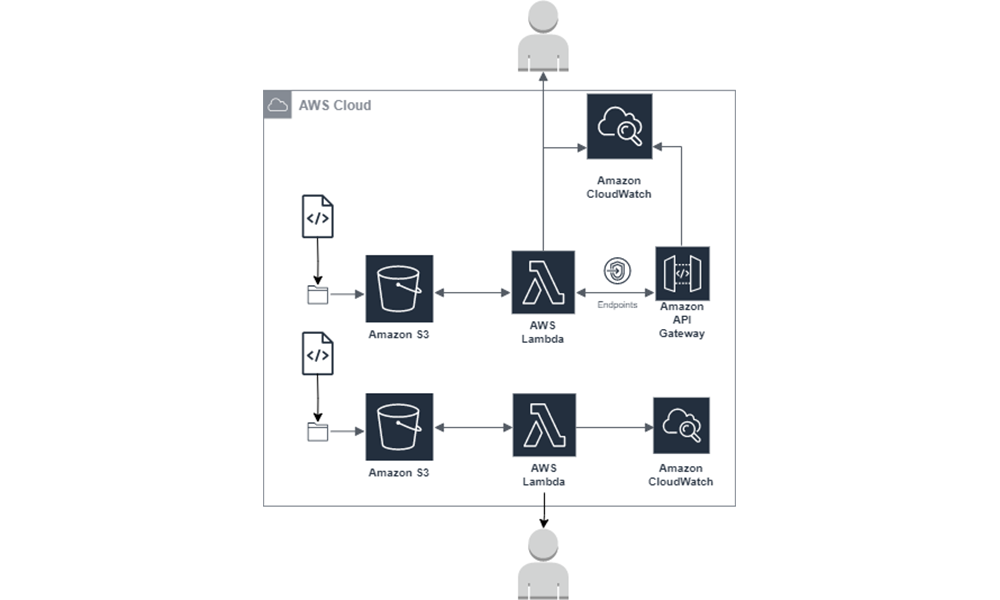
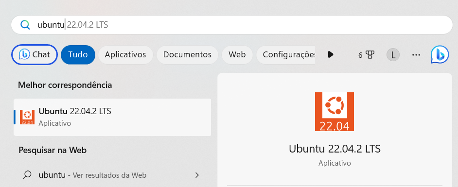
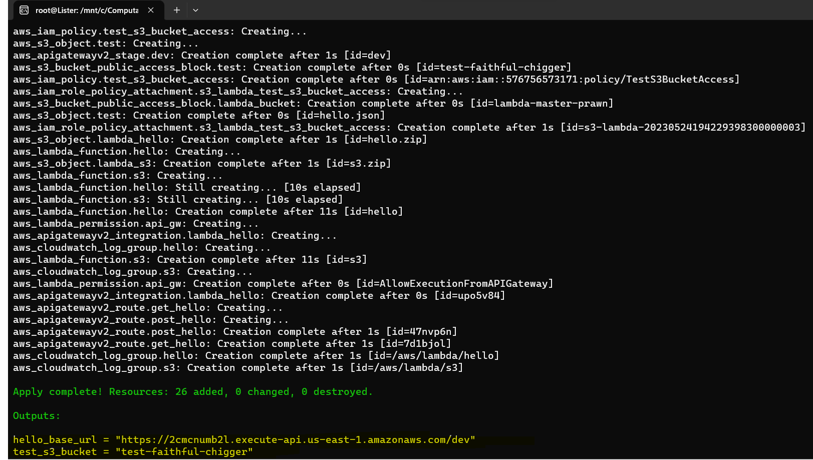
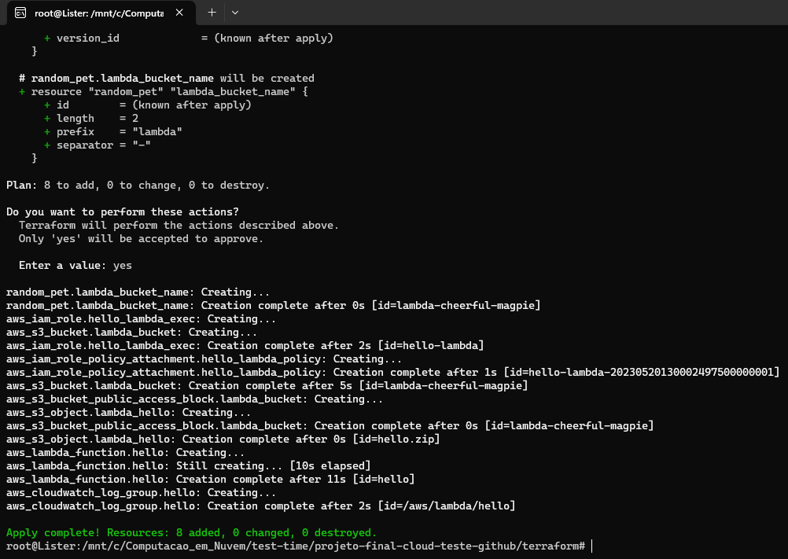
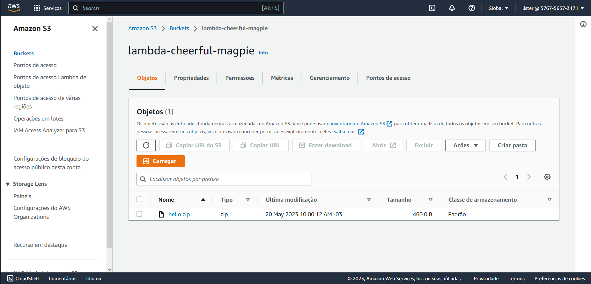
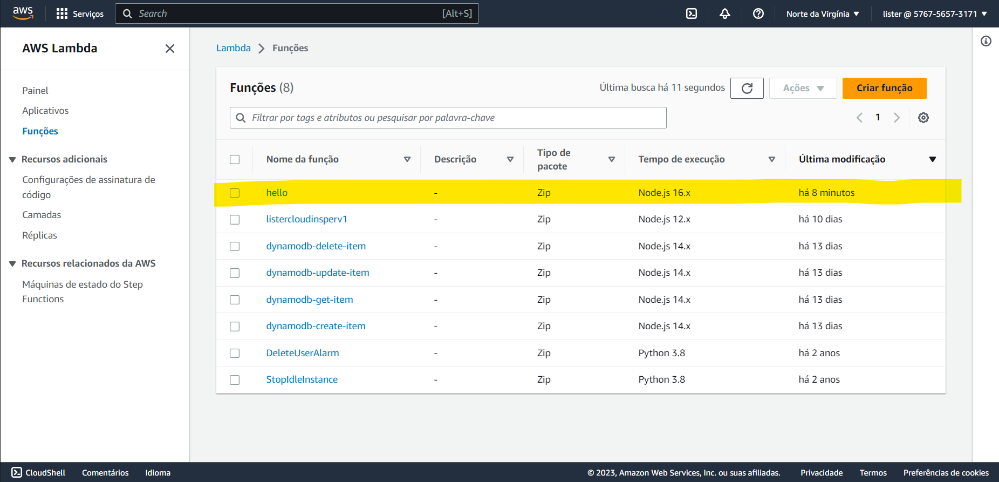
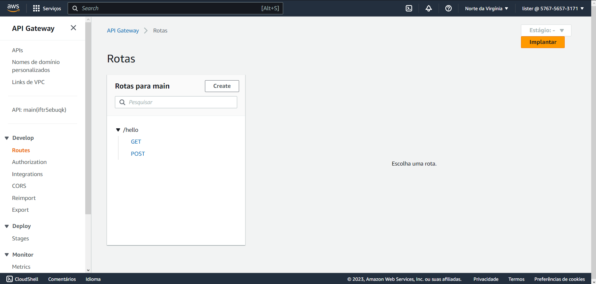
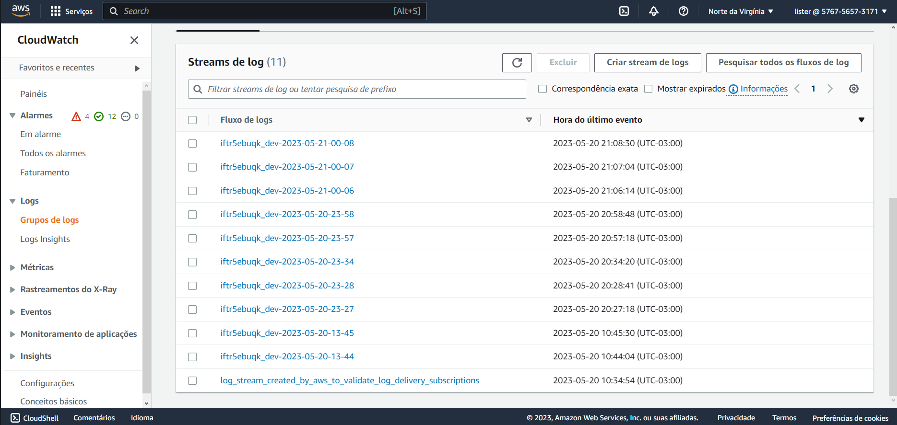
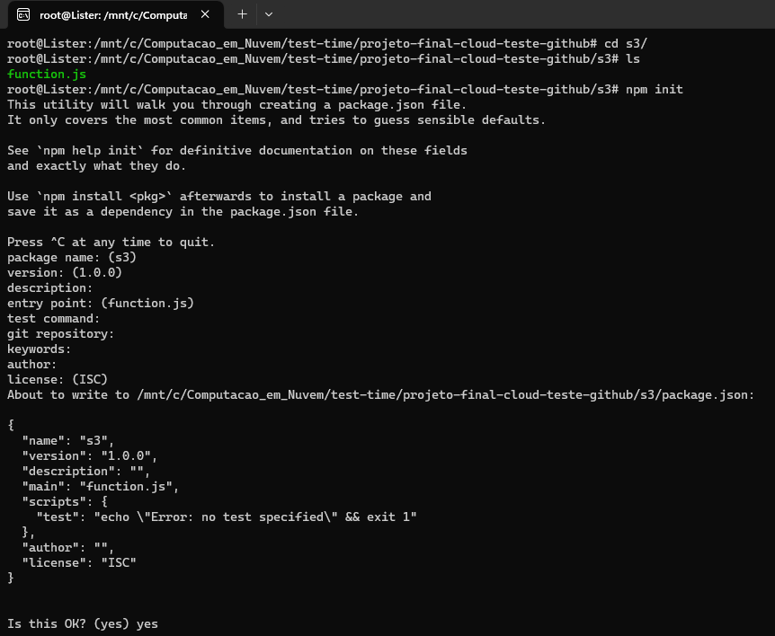
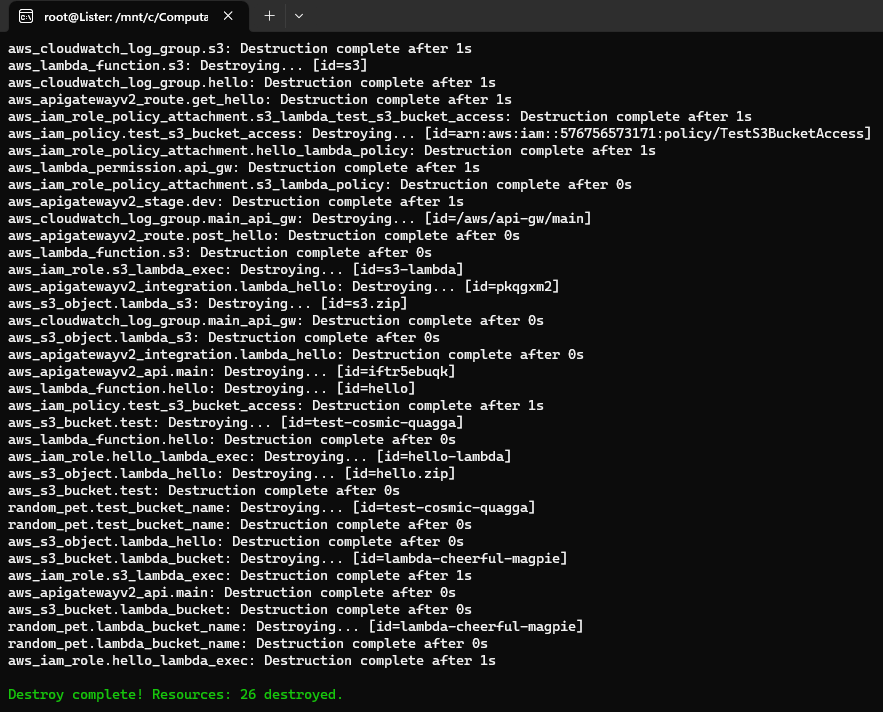

# Desenvolvendo a Infraestrutura

## :pencil: Sobre o Projeto

O Projeto a seguir visa aplicar conceitos de Computação em Nuvem (Cloud Computing) por meio da plataforma de serviços de Computação em Nuvem [**AWS (Amazon Web Services).**](https://aws.amazon.com/pt/what-is-aws/) A ideia é subir uma aplicação sem servidor na AWS utilizando o **[S3](https://aws.amazon.com/pt/s3/), [Lambda](https://aws.amazon.com/pt/lambda/), [API Gateway](https://aws.amazon.com/pt/api-gateway/) e o [CloudWatch](https://aws.amazon.com/pt/cloudwatch/)** colocando em prática os conceitos de **IaaC (Infrastructure as a Code)** por meio do Terraform. O diagrama visual da aplicação pode ser conferido a seguir:



## Desenvolvendo a infraestrutura

### 1. Pré-requisitos

- Para rodar nossa infraestrutura, estamos utilizando o **Ubuntu 22.04.2 LTS** (o qual já estava instalado no nosso Windows). A infra pode funcionar em outras versões, porém **_não há garantia de funcionamento._** Assim sendo, indicamos o uso da versão supracitada para testar nossa aplicação (e até mesmo para criar e rodar a sua própria).



- Conta no [**Github**](https://docs.aws.amazon.com/codedeploy/latest/userguide/tutorials-github-create-github-account.html) (+ [token de autorização](https://docs.github.com/en/authentication/keeping-your-account-and-data-secure/creating-a-personal-access-token), _se necessário_, com permissão de criação e atualização de repositórios), caso você desejar subir e deixar o projeto registrado.

- [Node.js instalado na máquina.](https://www.digitalocean.com/community/tutorials/how-to-install-node-js-on-ubuntu-20-04) (no caso, instalei diretamente dentro do Ubuntu 22.04.2 LTS via terminal).

- [Conta na AWS com usuário com permissões de Administrador.](https://docs.aws.amazon.com/pt_br/lex/latest/dg/gs-account.html)

- Terraform instalado na máquina (no caso, instalei diretamente dentro do Ubuntu 22.04.2 LTS e explico no próximo tópico como fazer você também).

- [Visual Studio Code (VS Code).](https://code.visualstudio.com)

- [AWS CLI](https://docs.aws.amazon.com/pt_br/cli/latest/userguide/getting-started-install.html)

### 2. Instalação do Terraform


A primeira etapa para desenvolvermos essa aplicação é instalar o Terraform na máquina. O Terraform é uma **ferramenta de gerenciamento de infraestrutura como código (IaC)** desenvolvida pela HashiCorp. Ele permite que os usuários definam, configurem e provisionem infraestruturas de forma automatizada e reprodutível, usando uma linguagem declarativa e uma sintaxe simples.
Com o Terraform, é possível criar e gerenciar recursos em diferentes provedores de nuvem, como AWS, Google Cloud, Azure e outros, bem como em plataformas de infraestrutura, como Kubernetes, Docker e OpenStack.
Em resumo, **o Terraform é uma ferramenta importante para automatizar e gerenciar infraestruturas de nuvem e outras plataformas de infraestrutura, tornando a gestão de infraestrutura escalável, segura e repetível.** _Sim, é o Terraform quem irá nos auxiliar a não ter que ficar fazendo tudo manualmente no dashboard da AWS, como acabamos de fazer na página anterior._

Caso você não possua o Terraform no seu computador, é necessário baixar e instalar de acordo com o tutorial presente [neste link (Windows)](https://www.youtube.com/watch?v=bSrV1Dr8py8) ou diretamente [neste link (Ubuntu/Linux - Recomendado)](https://developer.hashicorp.com/terraform/downloads).

### 3. Utilização

Após a instalação do Terraform na máquina, já é possível rodar a infraestrutura desenvolvida ou criar sua própria infraestrutura com base em tudo que está sendo apresentado aqui.

O primeiro passo é **clonar este repositório** em uma pasta dentro do seu computador. _Caso não saiba como clonar um repositório na sua máquina local, acesse o tutorial presente [neste link](https://docs.github.com/pt/repositories/creating-and-managing-repositories/cloning-a-repository) ou faça o download do respositório e descompacte o arquivo .zip no local desejado._

!!! Dica

    ***Caso você desejar criar a infraestrutura do zero, segui e sugiro a seguinte estrutura de pastas:***

```
Cloud-Project
│
│
└───hello
│   |---function.js
│
└───s3
|   │---function.js
│
│───Terraform
│   |---api-gateway.tf
│   |
│   |---hello-api-gateway.tf
│   |
│   |---hello-lamba.tf
│   |
│   |---lambda-s3-bucket.tf
│   |
│   |---provider.tf
│   |
│   |---s3-lambda.tf
│   |
│   |---test-bucket.tf
│   |
│   |---terraform.sh


```

Independentemente se você escolheu clonar o repositório com a infraestrutura original ou se tiver escolhido criar do zero, **lembre-se que tudo deve ser feito dentro do prompt de comando do Ubuntu 22.04.2 LTS** caso deseje chegar nos mesmos resultados apresentados aqui sem grandes riscos de problemas.

---

<!-- !!! info
Essas duas partes são obrigatórias no tutorial:

    - Nome de vocês
    - Começando
    - Motivação -->

## Credenciais AWS no Terraform

Antes de darmos início, é necessário **cadastrar suas credenciais AWS na sua máquina.**
Temos várias formas de fazer isso, porém iremos optar pela alternativa que eu considero mais segura para quem está iniciando na AWS (incluindo eu mesmo): cadastrar diretamente via terminal. _Sim, pode haver várias outras formas de fazer isso, então se você considera alguma outra melhor, fique à vontade._

Você deve possuir um .csv com a chave de acesso (Secret Key) e a chave secreta (Secret Access Key) de acesso da sua conta AWS, precisaremos dessas informações agora.

!!! warning "Aviso"

    A partir de agora, todos os comandos que utilizarmos ou alterações realizadas via prompt de comando deve ser feitas dentro da pasta que designamos para trabalhar neste projeto.
    Eu optei por trabalhar dentro da raiz da minha máquina, ou seja, **dentro do meu diretório**, estou trabalhando na seguinte pasta:

    root@Lister:/mnt/c/Computacao_em_Nuvem/testando-o-projeto-01/Cloud-Project


!!! Dica

    Para manipular arquivos dentro do terminal do Ubuntu, utilize os comandos:

    **cd** --> Para navegar entre as pastas dentro do seu computador;

    **ls** --> para visualizar os arquivos dentro das pastas;


    Exemplo de uso:

    **cd /mnt/c** --> Entrei na raiz do meu computador;
    
    
    **cd ..** --> Sai da raiz e "voltei um caminho", ou seja, agora estou no diretório "/mnt";

    **code .** --> Abre toda sua pasta dentro do VS Code (isso sempre me ajuda muito).


Dentro do terminal Ubuntu, insira os comandos:

```
aws configure
```

Após o comando acima, serão solicitadas as suas chaves de acesso. Coloque-as no terminal como solicitado e bora trabalhar!

## Rodando a aplicação (se você desejar APENAS rodar a infra já criada)


Caso você desejar **criar a infra (tal como sugerido e explicado detalhadamente neste handout)**, vá para a aba **["Criando a infraestrutura do zero"](https://listerogusuku.github.io/Cloud-Project/desenvolvendo-a-infraestrutura/#criando-a-infraestrutura-do-zero)** e continue o handout. Caso desejar **apenas rodá-la**, entre na pasta que você clonou a infra e, dentro do diretório "Cloud-Project/terraform" rode os seguintes comandos:

```
terraform init
```


E, em seguida, rode:

```
terraform plan
```

> The ***terraform plan command*** creates an execution plan, which lets you preview the changes that Terraform plans to make to your infrastructure. _(Texto extraído do site da Hashicorp)_

> O comando ***terraform plan*** cria um plano de execução, que permite visualizar as alterações que o Terraform planeja fazer em sua infraestrutura. _(Texto traduzido do site da Hashicorp)_

E, para finalizar, rode:

```
terraform apply
```



Após tudo ter funcionado, **a infra foi construída na AWS**, agora é só testar! 

!!! Dica

    Entre na sua **dashboard da AWS**, verifique todos os serviços criados e **tente entender como tudo foi criado e o que está acontecendo entre os serviços** (para isso, observar o diagrama apresentado no início do handout pode ajudar).


Para testar, digite no terminal:


```tf
curl -X POST \
-H "Content-Type: application/json" \
-d '{"name":"Insper"}' \
"https://<id>.execute-api.us-east-1.amazonaws.com/dev/hello"
          /\
          ||
Substitua <id> pelo seu id retornado no prompt de comando

```

!!! Dica

    Além do prompt de comando, teste também diretamente no seu navegador!
    Para fazer isso, basta substituir a url que foi retornada e passar algum parâmetro após "Name", da seguinte forma:

    https:// SEU-ID-AQUI .execute-api.us-east-1.amazonaws.com/dev/hello **+ o parâmetro** ?Name=Lister

    Por exemplo:

    https://2cmcnumb2l.execute-api.us-east-1.amazonaws.com/dev/hello?Name=Lister

Podemos também invocar essa função com o nome do bucket reebido no prompt de comando + nosso objeto para ver se o lambda conseguirá obter o objeto do bucket.

```sh
aws lambda invoke \
--region=us-east-1 \
--function-name=s3 \
--cli-binary-format raw-in-base64-out \
--payload '{"bucket":"test-<your>-<name>","object":"hello.json"}' \
response.json
                             /\
                             ||
      Substitua test-<your>-<name> pelo nome do seu bucket

```

Rode no terminal o seguinte comando:

```sh
cat response.json

```

:octicons-heart-fill-24:{ .mdx-heart } &nbsp; Se você receber como retorno **_Yeah, I am working from Insper, Avelinux :)_**, parabéns, você concluiu sua aplicação e ela está funcionando!

!!! warning "Dica Visual"

    Se entrarmos no dashboard do **CloudWatch** novamente, conseguiremos ver os logs de acesso registrados para nossas solicitações.


## Criando a infraestrutura do zero
## Criando uma função Lambda no Terraform

O primeiro passo será criarmos uma função lambda que, futuramente, será integrada com o AWS API Gateway.


Mas o que é o "Lambda"?

A AWS Lambda é um **serviço de computação sem servidor** que permite executar código de forma escalável e **sem a necessidade de gerenciar servidores.** Ela é projetada para responder a eventos específicos, como **alterações em um bucket do Amazon S3 ou atualizações em uma tabela do Amazon DynamoDB.**

Inicialmente, começaremos com uma função simples baseada em **NodeJS** sem nenhuma dependência.

<!--
!!! note
Bloco de destaque de texto, pode ser:

    - note, example, warning, info, tip, danger

!!! example "Faça assim"
É possível editar o título desses blocos

    !!! warning
        Isso também é possível de ser feito, mas
        use com parcimonia.

??? info
Também da para esconder o texto, usar para coisas
muito grandes, ou exemplos de códigos.

    ```txt
    ...


    oi!
    ```

- **Esse é um texto em destaque**
- ==Pode fazer isso também==

Usar emojis da lista:

:two_hearts: - https://github.com/caiyongji/emoji-list -->

=== "**index.js**"

```js linenums="1"
exports.handler = async (event) => {
  console.log("Event: ", event);
  let responseMessage = "Hello, World!";

  if (event.queryStringParameters && event.queryStringParameters["Name"]) {
    responseMessage = "Hello, " + event.queryStringParameters["Name"] + "!";
  }

  return response;
};
```

Ao invocar essa função com uma consulta de URL e com o parâmetro Name definido, ela retornará "Hello, _Name_!".

=== "**index.js**"

```js linenums="1"
exports.handler = async (event) => {
  console.log("Event: ", event);
  let responseMessage = "Hello, World!";

  if (event.queryStringParameters && event.queryStringParameters["Name"]) {
    responseMessage = "Hello, " + event.queryStringParameters["Name"] + "!";
  }

+  if (event.httpMethod === "POST") {
+    const body = JSON.parse(event.body);
+    responseMessage = "Hello, " + body.name + "!";
+  }

+  const response = {
+    statusCode: 200,
+    headers: {
+      "Content-Type": "application/json",
+    },
+    body: JSON.stringify({
+      message: responseMessage,
+    }),
+  };

  return response;
};
```

Também será verificado o método **HTTP GET e POST** para que seja verificada a resposta padrão. Foi especificado o **código de status '200', tipo de conteúdo e a mensagem** para ser retornada ao chamador.

## Criando o provider

Agora que nossa handler já está pronta, começaremos a trabalhar em alguns elementos do nosso Terraform.
Criaremos os arquivos **_.tf_** dentro de uma pasta intitulada (por motivos intuitivos, claro) como "terraform".

Começaremos criando o arquivo "provider.tf", em que serão declaradas as restrições de versão (região da AWS, por exemplo) para os diferentes provedores AWS, versões de Teraform e afins.

Isso é feito apenas para que, caso alguém pegue esse projeto no futuro e rode em outra versão de Terraform ou com configurações diferentes das que foram aqui padronizadas, o projeto não funcione.

=== "**terraform/provider.tf**"

```tf linenums="1"
terraform {
    required_providers {
    aws = {
        source = "hashicorp/aws"
        version = "~> 4.21.0"
        }
    # Aqui dentro poderíamos também ter estabelecido outras restrições
    # de versão, mas optei por deixar o mais simples possível.
    }

required_version = "~> 1.0"
}

provider "aws" {
    region = "us-east-1" # Região Northern Virginia
}
```

## Bucket do S3

Agora nós construiremos uma função com todas as dependências, empacotaremos como um arquivo **_zip_** para que, assim,
consigamos subir num bucket do S3. Ou seja, quando criamos o lambda, apontamos para esse objeto de arquvo zip no bucket S3.

Como os nomes dos buckets do S3 devem ser **únicos e exclusivos** no mundo inteiro, podemos utilizar um gerador aleatório para
nos ajudar a nomear nosso bucket S3.

=== "**terraform/lambda-bucket.tf**"

```tf linenums="1"
resource "random_pet" "lambda_bucket_name" {
prefix = "lambda"
length = 2
}

```

Em seguida, vamos criar o próprio bucket do S3 com o nome gerado.

=== "**terraform/lambda-bucket.tf**"

```tf linenums="1"

resource "random_pet" "lambda_bucket_name" {
  prefix = "lambda"
  length = 2
}

+resource "aws_s3_bucket" "lambda_bucket" {
+  bucket        = random_pet.lambda_bucket_name.id
+  force_destroy = true
+}


```

Por padrão, deixaremos todo o acesso público ao bucket bloqueado.

=== "**terraform/lambda-bucket.tf**"

```tf linenums="1"

resource "random_pet" "lambda_bucket_name" {
  prefix = "lambda"
  length = 2
}

resource "aws_s3_bucket" "lambda_bucket" {
  bucket        = random_pet.lambda_bucket_name.id
  force_destroy = true
}

+resource "aws_s3_bucket_public_access_block" "lambda_bucket" {
+  bucket = aws_s3_bucket.lambda_bucket.id

+  block_public_acls       = true
+  block_public_policy     = true
+  ignore_public_acls      = true
+  restrict_public_buckets = true
+}

```

## IAM e Policies

Agora criaremos o código Terraform do lambda. Lembrando que o lambda exigirá acesso a outros serviços da AWS (como o CloudWatch, para gravar logs) e, no nosso caso, concederemos acesso ao bucket do S3 para que seja possível a leitura de um arquivo.

Para isso, precisamos criar uma função do IAM e permitir que o lambda a use.

=== "**terraform/hello-lambda.tf**"

```tf linenums="1"

resource "aws_iam_role" "hello_lambda_exec" {
  name = "hello-lambda"

  assume_role_policy = <<POLICY
{
  "Version": "2012-10-17",
  "Statement": [
    {
      "Effect": "Allow",
      "Principal": {
        "Service": "lambda.amazonaws.com"
      },
      "Action": "sts:AssumeRole"
    }
  ]
}
POLICY
}

resource "aws_iam_role_policy_attachment" "hello_lambda_policy" {
  role       = aws_iam_role.hello_lambda_exec.name
  policy_arn = "arn:aws:iam::aws:policy/service-role/AWSLambdaBasicExecutionRole"
}

```

## Criando uma função Lambda

O próximo recurso será criar a função lambda, a qual chamaremos de "hello". Em seguida especificaremos o nome do intervalo onde
armazenaremos todos os lambdas. E nosso key pointing irá apontar para um arquivo zip com uma função.

O hash do código-fonte foi adicionado para reimplementar a função caso seja alterado/atualizado algo no código-fonte.
Se o hash do arquivo zip for diferente, a reimplantação do lambda será forçada.

=== "**terraform/hello-lambda.tf**"

```tf linenums="1"

resource "aws_iam_role" "hello_lambda_exec" {
  name = "hello-lambda"

  assume_role_policy = <<POLICY
{
  "Version": "2012-10-17",
  "Statement": [
    {
      "Effect": "Allow",
      "Principal": {
        "Service": "lambda.amazonaws.com"
      },
      "Action": "sts:AssumeRole"
    }
  ]
}
POLICY
}

resource "aws_iam_role_policy_attachment" "hello_lambda_policy" {
  role       = aws_iam_role.hello_lambda_exec.name
  policy_arn = "arn:aws:iam::aws:policy/service-role/AWSLambdaBasicExecutionRole"
}

+resource "aws_lambda_function" "hello" {
+  function_name = "hello"

+  s3_bucket = aws_s3_bucket.lambda_bucket.id
+  s3_key    = aws_s3_object.lambda_hello.key

+  runtime = "nodejs16.x"
+  handler = "function.handler"

+  source_code_hash = data.archive_file.lambda_hello.output_base64sha256

+  role = aws_iam_role.hello_lambda_exec.arn
+}

```

## Criando o CloudWatch

O CloudWatch é um serviço de **monitoramento e observabilidade** oferecido pela AWS. Ele permite que você **colete e monitore métricas, registros e eventos de diferentes recursos e serviços da AWS, fornecendo insights valiosos sobre o desempenho, a saúde e a disponibilidade do seu ambiente de nuvem.** Com o CloudWatch, você pode definir alarmes para acionar ações automáticas, criar painéis personalizados para visualizar dados em tempo real, além de acessar informações históricas para análise e solução de problemas. Ele é uma ferramenta fundamental para garantir o **monitoramento proativo e a operação eficiente dos seus recursos na nuvem da AWS.**

Para depurar, criamos um grupo de logs do CloudWatch que conseguisse armazenar todas as instruções e erros do console.log na função.
Definimos a retenção para 30 dias, porém poderia ser uma quantidade maior ou menor também, a depender das intenções de quem está
desenvolvendo a infraestrutura (além dessas decisões poderem afetar o custo de execução do lambda).

=== "**terraform/hello-lambda.tf**"

```tf linenums="1"
resource "aws_iam_role" "hello_lambda_exec" {
  name = "hello-lambda"

  assume_role_policy = <<POLICY
{
  "Version": "2012-10-17",
  "Statement": [
    {
      "Effect": "Allow",
      "Principal": {
        "Service": "lambda.amazonaws.com"
      },
      "Action": "sts:AssumeRole"
    }
  ]
}
POLICY
}

resource "aws_iam_role_policy_attachment" "hello_lambda_policy" {
  role       = aws_iam_role.hello_lambda_exec.name
  policy_arn = "arn:aws:iam::aws:policy/service-role/AWSLambdaBasicExecutionRole"
}

resource "aws_lambda_function" "hello" {
  function_name = "hello"

  s3_bucket = aws_s3_bucket.lambda_bucket.id
  s3_key    = aws_s3_object.lambda_hello.key

  runtime = "nodejs16.x"
  handler = "function.handler"

  source_code_hash = data.archive_file.lambda_hello.output_base64sha256

  role = aws_iam_role.hello_lambda_exec.arn
}

+resource "aws_cloudwatch_log_group" "hello" {
+  name = "/aws/lambda/${aws_lambda_function.hello.function_name}"

+  retention_in_days = 30
+}

```

Em seguida, adicionaremos o recurso que empacota o lambda como um arquivo zip.

=== "**terraform/hello-lambda.tf**"

```tf linenums="1"
resource "aws_iam_role" "hello_lambda_exec" {
  name = "hello-lambda"

  assume_role_policy = <<POLICY
{
  "Version": "2012-10-17",
  "Statement": [
    {
      "Effect": "Allow",
      "Principal": {
        "Service": "lambda.amazonaws.com"
      },
      "Action": "sts:AssumeRole"
    }
  ]
}
POLICY
}

resource "aws_iam_role_policy_attachment" "hello_lambda_policy" {
  role       = aws_iam_role.hello_lambda_exec.name
  policy_arn = "arn:aws:iam::aws:policy/service-role/AWSLambdaBasicExecutionRole"
}

resource "aws_lambda_function" "hello" {
  function_name = "hello"

  s3_bucket = aws_s3_bucket.lambda_bucket.id
  s3_key    = aws_s3_object.lambda_hello.key

  runtime = "nodejs16.x"
  handler = "function.handler"

  source_code_hash = data.archive_file.lambda_hello.output_base64sha256

  role = aws_iam_role.hello_lambda_exec.arn
}

resource "aws_cloudwatch_log_group" "hello" {
  name = "/aws/lambda/${aws_lambda_function.hello.function_name}"

  retention_in_days = 14
}

+data "archive_file" "lambda_hello" {
+  type = "zip"

+  source_dir  = "../${path.module}/hello"
+  output_path = "../${path.module}/hello.zip"
+}

```

Nosso último componente visa obter o arquivo zip e carregar no bucket do S3.

=== "**terraform/hello-lambda.tf**"

```tf linenums="1"
resource "aws_iam_role" "hello_lambda_exec" {
  name = "hello-lambda"

  assume_role_policy = <<POLICY
{
  "Version": "2012-10-17",
  "Statement": [
    {
      "Effect": "Allow",
      "Principal": {
        "Service": "lambda.amazonaws.com"
      },
      "Action": "sts:AssumeRole"
    }
  ]
}
POLICY
}

resource "aws_iam_role_policy_attachment" "hello_lambda_policy" {
  role       = aws_iam_role.hello_lambda_exec.name
  policy_arn = "arn:aws:iam::aws:policy/service-role/AWSLambdaBasicExecutionRole"
}

resource "aws_lambda_function" "hello" {
  function_name = "hello"

  s3_bucket = aws_s3_bucket.lambda_bucket.id
  s3_key    = aws_s3_object.lambda_hello.key

  runtime = "nodejs16.x"
  handler = "function.handler"

  source_code_hash = data.archive_file.lambda_hello.output_base64sha256

  role = aws_iam_role.hello_lambda_exec.arn
}

resource "aws_cloudwatch_log_group" "hello" {
  name = "/aws/lambda/${aws_lambda_function.hello.function_name}"

  retention_in_days = 30
}

data "archive_file" "lambda_hello" {
  type = "zip"

  source_dir  = "../${path.module}/hello"
  output_path = "../${path.module}/hello.zip"
}

+resource "aws_s3_object" "lambda_hello" {
+  bucket = aws_s3_bucket.lambda_bucket.id

+  key    = "hello.zip"
+  source = data.archive_file.lambda_hello.output_path

+  etag = filemd5(data.archive_file.lambda_hello.output_path)
+}

```

## Inicializando o Terraform

Com os passos feitos até aqui já conseguimos inicializar o terraform:

```tf
terraform init
```


Agora aplicamos as alterações:

```tf
terraform apply
```



> :warning: **Dica visual**

> Quando o terraform concluir suas etapas até aqui, podemos entrar no dashboard da AWS e encontrar, dentre outras coisas, um bucket S3 recém-criado com um nome definido por meio de um gerador de animais de estimação aleatório.
>  > 

---

**Para abstrair:**

Note que dentro do bucket são armazenadas funções lambdas dentro de um **zip.**

Quando entramos na dashboard da **AWS CloudWatch** também conseguimos ver o grupo de logs criado.


No dashboard do **AWS Lambda** conseguimos ver a função lambda empacotada como um zip.



---

Vamos agora invocar a função com o comando **_aws lambda invoke_**.

Lembre-se de especificar ou conferir se o nome da região, função e arquivo estão corretos para registrar a resposta da função.

```tf
aws lambda invoke --region=us-east-1 --function-name=hello response.json
```


Ao printarmos a resposta, é esperado um retorno **"Olá, Avelino!"**

```tf
cat response.json
```


## Criando o API Gateway

A próxima estapa será criar o API Gateway e integrá-lo ao nosso lambda.

O API Gateway é um serviço da AWS que permite **criar, publicar, proteger e gerenciar APIs (Interfaces de Programação de Aplicativos).** Ele atua como um ponto de entrada para os aplicativos acessarem funcionalidades e dados, fornecendo recursos como **autenticação, autorização, limitação de taxa e transformação de dados.** O API Gateway simplifica o processo de criação de APIs, permitindo que você se concentre na lógica do aplicativo, enquanto ele gerencia aspectos como escalabilidade, segurança e monitoramento. Com o API Gateway, é possível **criar APIs RESTful ou WebSocket para integrar e expor seus serviços e recursos de forma segura na nuvem da AWS.**

=== "**terraform/api-gateway.tf**"

```tf linenums="1"
resource "aws_apigatewayv2_api" "main" {
  name          = "main"
  protocol_type = "HTTP"
}

resource "aws_apigatewayv2_stage" "dev" {
  api_id = aws_apigatewayv2_api.main.id

  name        = "dev"
  auto_deploy = true

  access_log_settings {
    destination_arn = aws_cloudwatch_log_group.main_api_gw.arn

    format = jsonencode({
      requestId               = "$context.requestId"
      sourceIp                = "$context.identity.sourceIp"
      requestTime             = "$context.requestTime"
      protocol                = "$context.protocol"
      httpMethod              = "$context.httpMethod"
      resourcePath            = "$context.resourcePath"
      routeKey                = "$context.routeKey"
      status                  = "$context.status"
      responseLength          = "$context.responseLength"
      integrationErrorMessage = "$context.integrationErrorMessage"
      }
    )
  }
}

resource "aws_cloudwatch_log_group" "main_api_gw" {
  name = "/aws/api-gw/${aws_apigatewayv2_api.main.name}"

  retention_in_days = 30
}

```

## Integrando o API Gateway com o Lambda

No próximo arquivo Terraform, integraremos o API Gateway com o hello lambda. Primeiramente apontaremos para o ID do API Gateway que acabamos de criar. Em seguida utilizaremos PROXYS AWS e solicitações POST para encaminhar solicitações do API Gateway para o Lambda

=== "**terraform/hello-api-gateway.tf**"

```tf linenums="1"
resource "aws_apigatewayv2_integration" "lambda_hello" {
api_id = aws_apigatewayv2_api.main.id

integration_uri = aws_lambda_function.hello.invoke_arn
integration_type = "AWS_PROXY"
integration_method = "POST"
}

```

Podemos especificar qual tipo de solicitações queremos passar para o lambda, por exemplo: GET ou POST, como abaixo:

=== "**terraform/hello-api-gateway.tf**"

```tf linenums="1"
resource "aws_apigatewayv2_integration" "lambda_hello" {
api_id = aws_apigatewayv2_api.main.id

integration_uri = aws_lambda_function.hello.invoke_arn
integration_type = "AWS_PROXY"
integration_method = "POST"
}

+resource "aws_apigatewayv2_route" "get_hello" {
+api_id = aws_apigatewayv2_api.main.id

+route_key = "GET /hello"
+target = "integrations/${aws_apigatewayv2_integration.lambda_hello.id}"
+}

+resource "aws_apigatewayv2_route" "post_hello" {
+api_id = aws_apigatewayv2_api.main.id

+route_key = "POST /hello"
+target = "integrations/${aws_apigatewayv2_integration.lambda_hello.id}"
+}

```

Note que em ambos os exemplos é necessário especificar um destino para ser o nosso lambda.
Também precisamos conceder permissões ao API Gateway para invocar nossa função lambda:

=== "**terraform/hello-api-gateway.tf**"

```tf linenums="1"
resource "aws_apigatewayv2_integration" "lambda_hello" {
  api_id = aws_apigatewayv2_api.main.id

  integration_uri    = aws_lambda_function.hello.invoke_arn
  integration_type   = "AWS_PROXY"
  integration_method = "POST"
}

resource "aws_apigatewayv2_route" "get_hello" {
  api_id = aws_apigatewayv2_api.main.id

  route_key = "GET /hello"
  target    = "integrations/${aws_apigatewayv2_integration.lambda_hello.id}"
}

resource "aws_apigatewayv2_route" "post_hello" {
  api_id = aws_apigatewayv2_api.main.id

  route_key = "POST /hello"
  target    = "integrations/${aws_apigatewayv2_integration.lambda_hello.id}"
}

+resource "aws_lambda_permission" "api_gw" {
+  statement_id  = "AllowExecutionFromAPIGateway"
+  action        = "lambda:InvokeFunction"
+  function_name = aws_lambda_function.hello.function_name
+  principal     = "apigateway.amazonaws.com"

+  source_arn = "${aws_apigatewayv2_api.main.execution_arn}/*/*"
+}

```

## Invocando o Lambda

Por fim, vamos imprimir no console o URL que podemos usar para invocar o lambda.

=== "**terraform/hello-api-gateway.tf**"

```tf linenums="1"
resource "aws_apigatewayv2_integration" "lambda_hello" {
  api_id = aws_apigatewayv2_api.main.id

  integration_uri    = aws_lambda_function.hello.invoke_arn
  integration_type   = "AWS_PROXY"
  integration_method = "POST"
}

resource "aws_apigatewayv2_route" "get_hello" {
  api_id = aws_apigatewayv2_api.main.id

  route_key = "GET /hello"
  target    = "integrations/${aws_apigatewayv2_integration.lambda_hello.id}"
}

resource "aws_apigatewayv2_route" "post_hello" {
  api_id = aws_apigatewayv2_api.main.id

  route_key = "POST /hello"
  target    = "integrations/${aws_apigatewayv2_integration.lambda_hello.id}"
}

resource "aws_lambda_permission" "api_gw" {
  statement_id  = "AllowExecutionFromAPIGateway"
  action        = "lambda:InvokeFunction"
  function_name = aws_lambda_function.hello.function_name
  principal     = "apigateway.amazonaws.com"

  source_arn = "${aws_apigatewayv2_api.main.execution_arn}/*/*"
}

+output "hello_base_url" {
+  value = aws_apigatewayv2_stage.dev.invoke_url
+}

```

No terminal, daremos um apply no terraform.

```tf linenums="1"
terraform apply
```


> :warning: **Dica visual**

> _Se entrarmos no dashboard do **API Gateway**, podemos ver nosso estágio de desenvolvimento "dev" criado e, em "rotas", conseguimos encontrar os métodos ***GET e POST.***_ >  > 

Até essa etapa, **se você estiver seguindo a risca minha forma de fazer esse handout**, é esperada que a estrutura do seu código esteja como na imagem abaixo:


## Hora de testar

Vamos agora testar o método HTTP GET.
A função deve analisá-lo e retornar a mensagem **"Olá, _+ parâmetro de URL_"**

```tf
curl "https://<id>.execute-api.us-east-1.amazonaws.com/dev/hello?Name=InsperUniversity"
               /\
               ||
Substitua <id> pelo seu id retornado no prompt de comando
```


Também testaremos o método POST. Nesse caso, fornecemos um objeto json para o terminal e veremos que funciona também.

```tf
curl -X POST \
-H "Content-Type: application/json" \
-d '{"name":"Insper"}' \
"https://<id>.execute-api.us-east-1.amazonaws.com/dev/hello"
          /\
          ||
Substitua <id> pelo seu id retornado no prompt de comando

```


!!! Dica

    Além do prompt de comando, teste também diretamente no seu navegador!
    Para fazer isso, basta substituir a url que foi retornada e passar algum parâmetro após "Name", da seguinte forma:

    https:// SEU-ID-AQUI .execute-api.us-east-1.amazonaws.com/dev/hello **+ o parâmetro** ?Name=Lister

    Por exemplo:

    https://2cmcnumb2l.execute-api.us-east-1.amazonaws.com/dev/hello?Name=Lister

> :warning: **Dica visual**

> _Se entrarmos no dashboard do **CloudWatch**, conseguiremos ver os logs de acesso registrados para nossas solicitações._ >  > 

## Criando função lambda com dependências externas e acesso ao bucket S3

Vamos agora criar outra função lambda com dependências externas e que garanta acesso para a leitura de um arquivo em um bucket S3.

Novamente, utilizaremos o random pet para nos auxiliar com um nome aleatório e único para nosso bucket do S3 e dicionaremos o prefixo "test" (o que também auxilia na identificação do bucket).

Para esse bucket também deixaremos o acesso público desativado.

=== "**terraform/test-bucket.tf**"

```tf linenums="1"
resource "random_pet" "test_bucket_name" {
  prefix = "test"
  length = 2
}

resource "aws_s3_bucket" "test" {
  bucket        = random_pet.test_bucket_name.id
  force_destroy = true
}

resource "aws_s3_bucket_public_access_block" "test" {
  bucket = aws_s3_bucket.test.id

  block_public_acls       = true
  block_public_policy     = true
  ignore_public_acls      = true
  restrict_public_buckets = true
}

```

Nós também podemos criar um objeto no S3 bucket utilizando terraform e o jsoncode build-in. Isso irá converter para um objeto json válido.

=== "**terraform/test-bucket.tf**"

```tf linenums="1"
resource "random_pet" "test_bucket_name" {
  prefix = "test"
  length = 2
}

resource "aws_s3_bucket" "test" {
  bucket        = random_pet.test_bucket_name.id
  force_destroy = true
}

resource "aws_s3_bucket_public_access_block" "test" {
  bucket = aws_s3_bucket.test.id

  block_public_acls       = true
  block_public_policy     = true
  ignore_public_acls      = true
  restrict_public_buckets = true
}

+resource "aws_s3_object" "test" {
+  bucket = aws_s3_bucket.test.id

+  key     = "hello.json"
+  content = jsonencode({ name = "S3" })
+}

+output "test_s3_bucket" {
+  value = random_pet.test_bucket_name.id
+}

```

Agora iremos criar uma nova função lambda em uma nova pasta s3.

Começaremos importando o aws-sdk e inicializando o objeto javascript.

Essa função irá nos retornar o conteúdo do objeto.

=== "**s3/function.js**"

```js linenums="1"
const aws = require("aws-sdk");

const s3 = new aws.S3({ apiVersion: "2006-03-01" });

exports.handler = async (event, context) => {
  console.log("Received event:", JSON.stringify(event, null, 2));

  const bucket = event.bucket;
  const object = event.object;
  const key = decodeURIComponent(object.replace(/\+/g, " "));

  const params = {
    Bucket: bucket,
    Key: key,
  };
  try {
    const { Body } = await s3.getObject(params).promise();
    const content = Body.toString("utf-8");
    return content + " Yeah, I am working, Avelinux :) !!";
  } catch (err) {
    console.log(err);
    const message = `Error getting object ${key} from bucket ${bucket}.`;
    console.log(message);
    throw new Error(message);
  }
};
```

Dentro do diretório da recém-criada pasta "s3", devemos inicializar o projeto nodejs com o seguinte comando:

=== "**/s3**"

```tf
npm init
```

Esse comando irá gerar arquivos _package.json_ com dependências.
**_Não há necessidade de preencher as informações solicitadas, basta teclar "enter" para cada info solicitada._**



Em seguida, iremos instalar o módulo [aws-sdk](https://aws.amazon.com/pt/sdk-for-javascript/):

=== "**/s3**"

```tf
npm install aws-sdk
```


Agora retornaremos à pasta "Terraform" e iremos criar nossas políticas de acesso.

=== "**terraform/s3-lambda.tf**"

```tf linenums="1"
resource "aws_iam_role" "s3_lambda_exec" {
  name = "s3-lambda"

  assume_role_policy = <<POLICY
{
  "Version": "2012-10-17",
  "Statement": [
    {
      "Effect": "Allow",
      "Principal": {
        "Service": "lambda.amazonaws.com"
      },
      "Action": "sts:AssumeRole"
    }
  ]
}
POLICY
}

resource "aws_iam_role_policy_attachment" "s3_lambda_policy" {
  role       = aws_iam_role.s3_lambda_exec.name
  policy_arn = "arn:aws:iam::aws:policy/service-role/AWSLambdaBasicExecutionRole"
}

resource "aws_iam_policy" "test_s3_bucket_access" {
  name        = "TestS3BucketAccess"

  policy = jsonencode({
    Version = "2012-10-17"
    Statement = [
      {
        Action = [
          "s3:GetObject", #Permitir obter um objeto do bucket
        ]
        Effect   = "Allow"
        Resource = "arn:aws:s3:::${aws_s3_bucket.test.id}/*"
      },
    ]
  })
}

# Política para acessar o novo bucket do s3:

resource "aws_iam_role_policy_attachment" "s3_lambda_test_s3_bucket_access" {
  role       = aws_iam_role.s3_lambda_exec.name
  policy_arn = aws_iam_policy.test_s3_bucket_access.arn
}

# Aqui teremos apoio na extração do aquivo zip da função

resource "aws_lambda_function" "s3" {
  function_name = "s3"

  s3_bucket = aws_s3_bucket.lambda_bucket.id
  s3_key    = aws_s3_object.lambda_s3.key

  runtime = "nodejs16.x"
  handler = "function.handler"

  source_code_hash = data.archive_file.lambda_s3.output_base64sha256

  role = aws_iam_role.s3_lambda_exec.arn
}

# Novo grupo de logs do CloudWatch para a função:

resource "aws_cloudwatch_log_group" "s3" {
  name = "/aws/lambda/${aws_lambda_function.s3.function_name}"

  retention_in_days = 14
}


# "Compacte a função e carregue o zip para o bucket s3:"

data "archive_file" "lambda_s3" {
  type = "zip"

  source_dir  = "../${path.module}/s3"
  output_path = "../${path.module}/s3.zip"
}

resource "aws_s3_object" "lambda_s3" {
  bucket = aws_s3_bucket.lambda_bucket.id

  key    = "s3.zip"
  source = data.archive_file.lambda_s3.output_path

  source_hash = filemd5(data.archive_file.lambda_s3.output_path)
}
```

Vamos agora deployar diretamente na máquina local. Para isso será necessário criar um simples script wrapper no Terraform:

=== "**terraform/terraform.sh**"

```sh linenums="1"
#!/bin/sh

set -e

cd ../s3
npm ci

cd ../terraform
terraform apply

```

(No terminal, diretório **/terraform**) Vamos fazer o script se tornar executável:

```sh
chmod +x terraform.sh

```

Em seguida podemos rodar:

```sh
./terraform.sh

```


Note que, ao rodarmos o comando acima, ele automaticamente rodará nosso terraform.sh que possui um "terraform apply", **aplicando imediatamente as alterações que fizemos**, sem que tenhamos que utilizar novamente o comando _"terraform apply"_ no terminal.

No terminal receberemos de volta o nome do nosso recém-criado bucket do s3. Podemos invocar essa função s3 com o nome do bucket + nosso objeto para ver se o lambda conseguirá obter o objeto do bucket.

```sh
aws lambda invoke \
--region=us-east-1 \
--function-name=s3 \
--cli-binary-format raw-in-base64-out \
--payload '{"bucket":"test-<your>-<name>","object":"hello.json"}' \
response.json
                             /\
                             ||
      Substitua test-<your>-<name> pelo nome do seu bucket

```

Por fim, rode no terminal o seguinte comando:

```sh
cat response.json

```


:octicons-heart-fill-24:{ .mdx-heart } &nbsp; Se você receber como retorno **_Yeah, I am working from Insper, Avelinux :)_**, parabéns, você concluiu sua aplicação e ela está funcionando!

!!! warning "Dica Visual"

    Se entrarmos no dashboard do **CloudWatch** novamente, conseguiremos ver os logs de acesso registrados para nossas solicitações.

Agora que você já viu todo o ambiente da sua IaaC (Infrastructure as a Code) sendo criado e funcionando, **chegou a hora de destruí-lo!**

Utilize o comando a seguir no seu terminal para destruir a infraestrutura:

```sh
terraform destroy
```

O resultado final deve ser algo parecido com a imagem a seguir:



!!! warning "**Dica visual**"

    Entre no dashboard da AWS e veja que todos os recursos sumiram: eles foram destruídos!

## Conclusão

Parabéns, você acaba de construir _(e destruir também)_ toda uma infraestrutura serverless na AWS! E aí, está se sentindo mais preparado para dar início aos seus próprios projetos?

Você viu como foi **bem mais fácil** construir toda nossa infraestrutura rodando apenas um conjunto de códigos de uma só vez ao invés de criar serviço por serviço via dashboard da AWS?

A intenção do handout acima era justamente essa! Queria mostrar pra vocês como o uso do Terraform facilita _- e muito -_ o nosso trabalho e também mostrar um pouco o poder do uso da Computação em Nuvem. Lembre-se que **o universo Cloud é imenso e possui milhares de possibilidades**, então **não se restrinja** apenas a criar aplicações sem servidor ou sites estáticos! Conheça novos serviços e começe a desfrutar cada vez mais do incrível poder que a Computação em Nuvem pode te oferecer! _(E olha que eu nem estou sendo patrocinado para falar tudo isso aqui! Alô @AWS, cadê meu cachê??!!)_

Antes de finalizar, confira a seção **"Vídeos de aprofundamento"** _(caso você ainda não tenha conferido)_ para entender um pouco melhor _(e de forma mais visual)_ o mundo da Computação em Nuvem. Também recomendo conferir a aba **"Referências"**, lá eu deixei vários links que me ajudaram a compreender muito mais a fundo tudo que eu estava desenvolvendo na AWS _(e tudo que vocês viram neste handout)_ durante as últimas 2 semanas _(sim, ***até 2 semanas atrás eu não entendia absolutamente nada de AWS***, então se eu consegui aprender tudo isso até aqui, você também consegue)._

Por hoje é só! Espero que tenham gostado de todo o material que eu montei aqui. Até a próxima! Tchau :)

<!--
# Desenvovendo a infraestrutura

Project documentation is as diverse as the projects themselves and Material for
MkDocs is a great starting point for making it look beautiful. However, as you
write your documentation, you may reach a point where small adjustments are
necessary to preserve your brand's style.

## Adding assets

[MkDocs] provides several ways to customize a theme. In order to make a few
small tweaks to Material for MkDocs, you can just add CSS and JavaScript files to
the `docs` directory.

  [MkDocs]: https://www.mkdocs.org

### Additional CSS

If you want to tweak some colors or change the spacing of certain elements,
you can do this in a separate style sheet. The easiest way is by creating a
new style sheet file in the `docs` directory:

``` { .sh .no-copy }
.
├─ docs/
│  └─ stylesheets/
│     └─ extra.css
└─ mkdocs.yml
```

Then, add the following lines to `mkdocs.yml`:

``` yaml
extra_css:
  - stylesheets/extra.css
```

### Additional JavaScript

If you want to integrate another syntax highlighter or add some custom logic to
your theme, create a new JavaScript file in the `docs` directory:

``` { .sh .no-copy }
.
├─ docs/
│  └─ javascripts/
│     └─ extra.js
└─ mkdocs.yml
```

Then, add the following lines to `mkdocs.yml`:

``` yaml
extra_javascript:
  - javascripts/extra.js
```

## Extending the theme

If you want to alter the HTML source (e.g. add or remove some parts), you can
extend the theme. MkDocs supports [theme extension], an easy way to override
parts of Material for MkDocs without forking from git. This ensures that you
can update to the latest version more easily.

  [theme extension]: https://www.mkdocs.org/user-guide/styling-your-docs/#using-the-theme-custom_dir

### Setup and theme structure

Enable Material for MkDocs as usual in `mkdocs.yml`, and create a new folder
for `overrides` which you then reference using the [`custom_dir`][custom_dir]
setting:

``` yaml
theme:
  name: material
  custom_dir: overrides
```

!!! warning "Theme extension prerequisites"

    As the [`custom_dir`][custom_dir] setting is used for the theme extension
    process, Material for MkDocs needs to be installed via `pip` and referenced
    with the [`name`][name] setting in `mkdocs.yml`. It will not work when
    cloning from `git`.

The structure in the `overrides` directory must mirror the directory structure
of the original theme, as any file in the `overrides` directory will replace the
file with the same name which is part of the original theme. Besides, further
assets may also be put in the `overrides` directory:

``` { .sh .no-copy }
.
├─ .icons/                             # Bundled icon sets
├─ assets/
│  ├─ images/                          # Images and icons
│  ├─ javascripts/                     # JavaScript files
│  └─ stylesheets/                     # Style sheets
├─ partials/
│  ├─ integrations/                    # Third-party integrations
│  │  ├─ analytics/                    # Analytics integrations
│  │  └─ analytics.html                # Analytics setup
│  ├─ languages/                       # Translation languages
│  ├─ actions.html                     # Actions
│  ├─ comments.html                    # Comment system (empty by default)
│  ├─ consent.html                     # Consent
│  ├─ content.html                     # Page content
│  ├─ copyright.html                   # Copyright and theme information
│  ├─ feedback.html                    # Was this page helpful?
│  ├─ footer.html                      # Footer bar
│  ├─ header.html                      # Header bar
│  ├─ icons.html                       # Custom icons
│  ├─ language.html                    # Translation setup
│  ├─ logo.html                        # Logo in header and sidebar
│  ├─ nav.html                         # Main navigation
│  ├─ nav-item.html                    # Main navigation item
│  ├─ pagination.html                  # Pagination (used for blog)
│  ├─ post.html                        # Blog post excerpt
│  ├─ search.html                      # Search interface
│  ├─ social.html                      # Social links
│  ├─ source.html                      # Repository information
│  ├─ source-file.html                 # Source file information
│  ├─ tabs.html                        # Tabs navigation
│  ├─ tabs-item.html                   # Tabs navigation item
│  ├─ tags.html                        # Tags
│  ├─ toc.html                         # Table of contents
│  └─ toc-item.html                    # Table of contents item
├─ 404.html                            # 404 error page
├─ base.html                           # Base template
├─ blog.html                           # Blog index page
├─ blog-archive.html                   # Blog archive index page
├─ blog-category.html                  # Blog category index page
├─ blog-post.html                      # Blog post page
└─ main.html                           # Default page
```

  [custom_dir]: https://www.mkdocs.org/user-guide/configuration/#custom_dir
  [name]: https://www.mkdocs.org/user-guide/configuration/#name

### Overriding partials

In order to override a partial, we can replace it with a file of the same name
and location in the `overrides` directory. For example, to replace the original
`footer.html` partial, create a new `footer.html` partial in the `overrides`
directory:

``` { .sh .no-copy }
.
├─ overrides/
│  └─ partials/
│     └─ footer.html
└─ mkdocs.yml
```

MkDocs will now use the new partial when rendering the theme. This can be done
with any file.

### Overriding blocks <small>recommended</small> { #overriding-blocks data-toc-label="Overriding blocks" }

Besides overriding partials, it's also possible to override (and extend)
template blocks, which are defined inside the templates and wrap specific
features. In order to set up block overrides, create a `main.html` file inside
the `overrides` directory:

``` { .sh .no-copy }
.
├─ overrides/
│  └─ main.html
└─ mkdocs.yml
```

Then, e.g. to override the site title, add the following lines to `main.html`:

``` html



  <title>Lorem ipsum dolor sit amet</title>

```

If you intend to __add__ something to a block rather than to replace it
altogether with new content, use `{{ super() }}` inside the block to include the
original block content. This is particularly useful when adding third-party
scripts to your docs, e.g.

``` html



  <!-- Add scripts that need to run before here -->

{{ super() }}

  <!-- Add scripts that need to run afterwards here -->



```

The following template blocks are provided by the theme:

| Block name        | Purpose                                         |
| :---------------- | :---------------------------------------------- |
| `analytics`       | Wraps the Google Analytics integration          |
| `announce`        | Wraps the announcement bar                      |
| `config`          | Wraps the JavaScript application config         |
| `container`       | Wraps the main content container                |
| `content`         | Wraps the main content                          |
| `extrahead`       | Empty block to add custom meta tags             |
| `fonts`           | Wraps the font definitions                      |
| `footer`          | Wraps the footer with navigation and copyright  |
| `header`          | Wraps the fixed header bar                      |
| `hero`            | Wraps the hero teaser (if available)            |
| `htmltitle`       | Wraps the `<title>` tag                         |
| `libs`            | Wraps the JavaScript libraries (header)         |
| `outdated`        | Wraps the version warning                       |
| `scripts`         | Wraps the JavaScript application (footer)       |
| `site_meta`       | Wraps the meta tags in the document head        |
| `site_nav`        | Wraps the site navigation and table of contents |
| `styles`          | Wraps the style sheets (also extra sources)     |
| `tabs`            | Wraps the tabs navigation (if available)        |

## Theme development

Material for MkDocs is built on top of [TypeScript], [RxJS] and [SASS], and
uses a lean, custom build process to put everything together.[^1] If you want
to make more fundamental changes, it may be necessary to make the adjustments
directly in the source of the theme and recompile it.

  [^1]:
    Prior to :octicons-tag-24: 7.0.0 the build was based on Webpack, resulting
    in occasional broken builds due to incompatibilities with loaders and
    plugins. Therefore, we decided to swap Webpack for a leaner solution which
    is now based on [RxJS] as the application itself. This allowed for the
    pruning of more than 500 dependencies (~30% less).

  [TypeScript]: https://www.typescriptlang.org/
  [RxJS]: https://github.com/ReactiveX/rxjs
  [SASS]: https://sass-lang.com

### Environment setup

In order to start development on Material for MkDocs, a [Node.js] version of
at least 14 is required. First, clone the repository:

```

git clone https://github.com/squidfunk/mkdocs-material

```

Next, all dependencies need to be installed, which is done with:

```

cd mkdocs-material
pip install -e .
pip install mkdocs-minify-plugin
pip install mkdocs-redirects
npm install

```

  [Node.js]: https://nodejs.org

### Development mode

Start the watcher with:

```

npm start

```

Then, in a second terminal window, start the MkDocs live preview server with:

```

mkdocs serve --watch-theme

````

Point your browser to [localhost:8000][live preview] and you should see this
very documentation in front of you.

!!! warning "Automatically generated files"

    Never make any changes in the `material` directory, as the contents of this
    directory are automatically generated from the `src` directory and will be
    overwritten when the theme is built.

  [live preview]: http://localhost:8000

### Building the theme

When you're finished making your changes, you can build the theme by invoking:

``` sh
npm run build # (1)!
````

1.  While this command will build all theme files, it will skip the overrides
    used in Material for MkDocs' own documentation which are not distributed
    with the theme. If you forked the theme and want to build the overrides
    as well, use:

    ```
    npm run build:all
    ```

    This will take longer, as now the icon search index, schema files, as
    well as additional style sheet and JavaScript files are built.

This triggers the production-level compilation and minification of all style
sheets and JavaScript files. After the command exits, the compiled files are
located in the `material` directory. When running `mkdocs build`, you should
now see your changes to the original theme. -->
