Chegou a hora de utilizar o seu primeiro serviço da AWS: o **AWS S3.**

## Mas, afinal, o que é e para que serve o S3?

> O **_Amazon Simple Storage Service (Amazon S3)_** é um serviço de armazenamento de objetos que oferece **_escalabilidade, disponibilidade de dados, segurança e performance líderes do setor._** Clientes de todos os portes e setores podem **_armazenar e proteger qualquer quantidade de dados_** de praticamente qualquer caso de uso, como data lakes, aplicações nativas da nuvem e aplicações móveis. Com classes de armazenamento econômicas e recursos de gerenciamento fáceis de usar, você pode **_otimizar custos, organizar dados e configurar controles de acesso ajustados para atender a requisitos específicos de negócios, organizacionais e de conformidade._** _(Texto extraído da página do S3 na AWS)_


## Exemplos de uso do S3

**Armazenamento de backup:** Você pode usar o S3 para armazenar backups de bancos de dados, servidores, arquivos de log e outros dados importantes. Ele oferece alta durabilidade, redundância e segurança para garantir a proteção dos seus backups.

**Hospedagem de sites estáticos:** O S3 pode ser usado para hospedar sites estáticos, como páginas HTML, CSS e JavaScript. Você pode configurar o S3 para servir os arquivos diretamente para os visitantes do site, proporcionando um armazenamento de baixo custo e escalável para o seu conteúdo estático.

**Armazenamento de dados para aplicativos:** Muitos aplicativos usam o S3 para armazenar e acessar arquivos de dados, como imagens, vídeos, documentos e arquivos de configuração. Ele fornece uma interface simples e APIs poderosas para manipulação de objetos, permitindo que os desenvolvedores integrem facilmente o armazenamento de objetos em seus aplicativos.

Esses são apenas alguns exemplos de uso do AWS S3. A flexibilidade e a escalabilidade do serviço o tornam adequado para uma ampla variedade de casos de uso, desde armazenamento simples até aplicativos complexos de big data e distribuição de conteúdo.

## Hospedando site estático no S3

Começaremos a colocar a mão na massa **hospedando um site estático simples no S3 de forma manual via dashboard da AWS.**

### Criando um bucket S3

O primeiro passo será criarmos um **bucket S3.** Um bucket, que na traduação literal significa "balde", de fato pode ser entendido como um _"balde armazenador de informações"_, sendo as **"informações"** o seu **site estático.**

No dashboard da AWS, procure pelo **"Amazon S3".**

Ao entrar na página do S3, clique em **"Criar Bucket".**

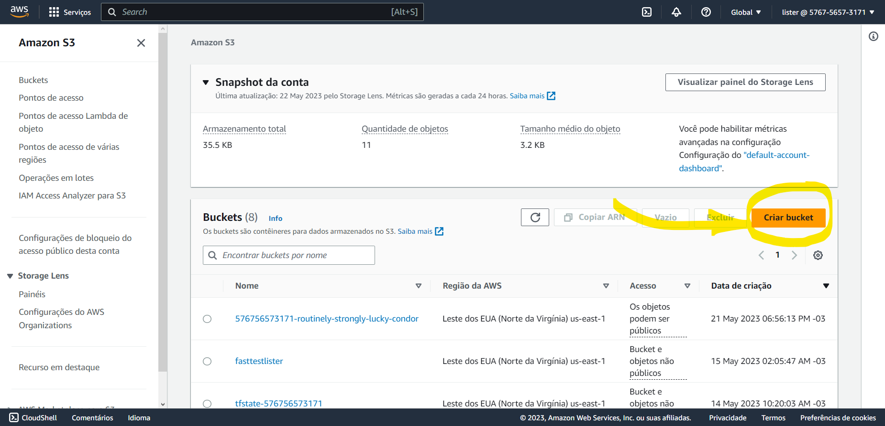

Agora daremos início à **criação do bucket do S3!**


!!! warning "Atenção!"

    Os buckets do S3 devem possuir nomes únicos e exclusivos no mundo todo (pois ele irá gerar um endpoint para nós), então certifique-se que o nome que você está usando não aparenta ser um nome já utilizado por outra pessoa antes.

Todas as demais configurações deixaremos padrão, como nas imagens a seguir:


!!! warning "Atenção!"

    O acesso que estamos configurando é o do bucket como um todo. Por questão de boa prática, deixaremos o acesso público aqui nessa etapa desativado e mostraremos ainda neste tutorial como definir as regras de segurança para cada arquivo.

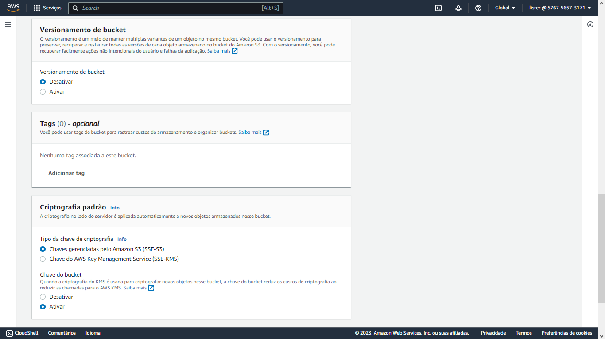

E, após verificarmos as etapas acima, clicaremos em **"Criar Bucket".**

Após a criação do bucket ter sido bem sucedida, conseguiremos ver nosso bucket no dashboard do S3:

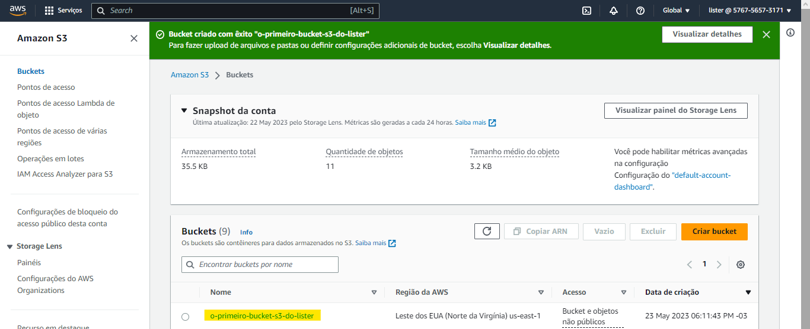

Ao entrar no nosso bucket, podemos ver que não há nenhum objeto/arquivo dentro dele:

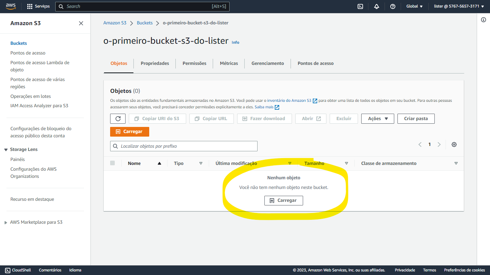

### Alterando as permissões do bucket

Vamos agora entrar na aba "Permissões" do nosso bucket e desbloquear o acesso clicando em "Editar":


Em seguida, desmarque a caixa com a opção "Bloquear todo o acesso público" e salve as alterações.

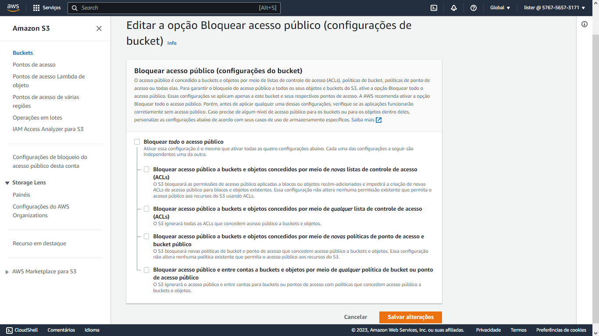

Em seguida, procure por "Propriedade de Objeto", selecione a opção "ACLs habilitadas" e salve as alterações:

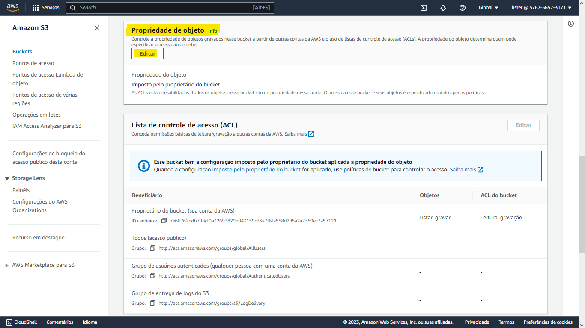


Agora procure por "Lista de controle de acesso (ACL)" e clique em "Editar":

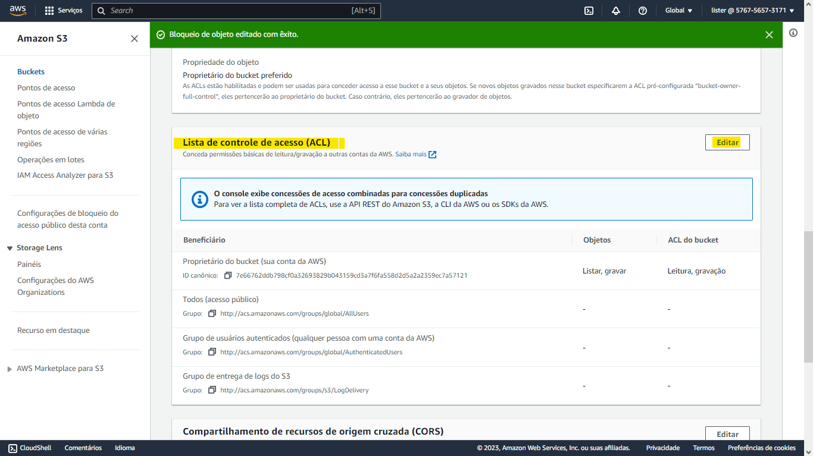

!!! warning "Atenção!"

    AGORA TOME MUITO CUIDADO!

Nessa página nós **NÃO** faremos nenhuma alteração. Chegamos até aqui apenas para você ver que **nosso bucket não está com a opção de "Acesso público para todos" ativada**, ou seja, seguimos a boa prática de **não liberar o bucket como um todo para acesso público.** Assim sendo, você já pode sair dessa página.

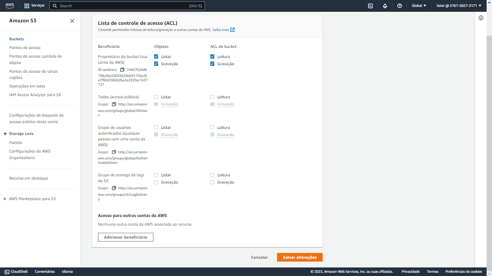

### Carregando arquivos dentro do seu bucket

Agora sim iremos armazenar algo dentro do nosso bucket. Dentro do seu bucket, na aba "Objetos", clique em "Carregar" e suba o(s) aquivo(s) que você desejar. Isso pode ir desde uma imagem, até um html, css etc. Neste tutorial optei por subir no bucket o logotipo do Insper.


Verifique se o(s) arquivo(s) que você selecionou para armazenar no seu bucket está(ão) correto(s) e, caso sim, clique em "Carregar".

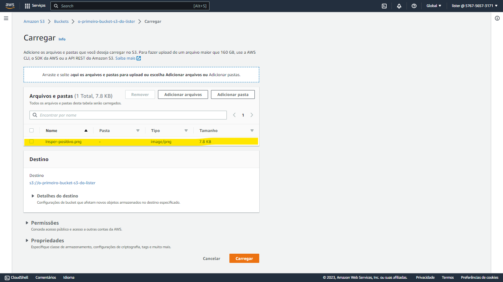

Após caregar, você deverá ver uma página com um link para o seu bucket do S3, clique nele.

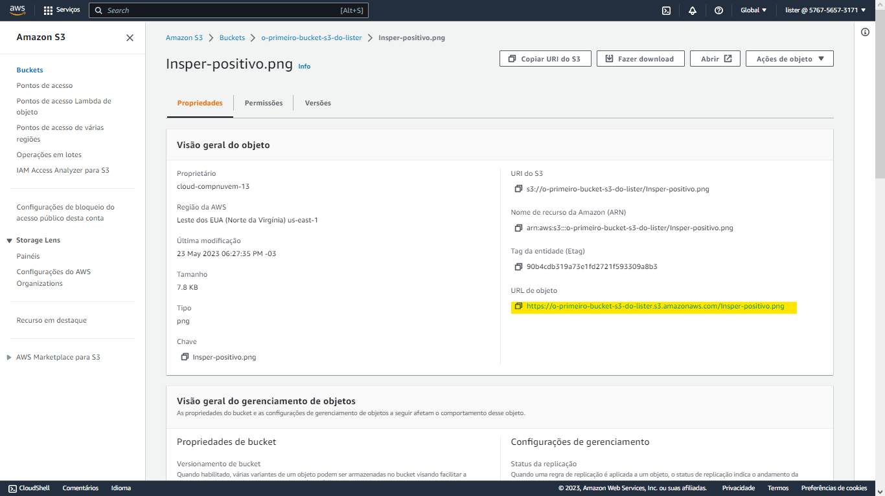

### Vish, deu ruim!

Ao clicar no link, é esperado que você entre em uma página semelhante a da imagem a seguir e não consiga acessar o conteúdo do bucket _(pense um pouco em tudo o que falamos sobre "boas práticas de acesso ao bucket" como um todo e aos arquivos para entender o que houve)._


??? question "Hora de pensar: Por que não estamos conseguindo acessar nosso site e o que fazer?"

    Ok, queremos acessar o conteúdo do bucket (nosso site) pelo link, mas não estamos conseguindo, o que fazer então? Simples! Iremos deixar **os arquivos que desejamos exibir públicos!** Para isso, acesse o arquivo que você carregou no S3 e vá na aba **"Permissões".** Dentro dessa aba, clique em **"Editar"** e, em seguida, **habilite as opções de leitura para todos.** Salve as alterações e atualize a página com o link que você tinha tentado acessar previamente.

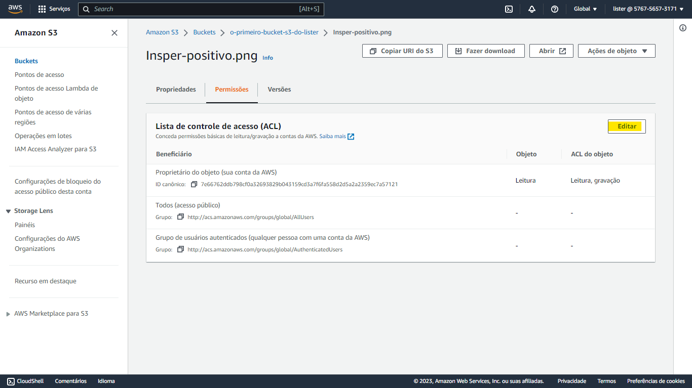


### Habemus site!

É isso mesmo, agora você consegue ver o conteúdo do seu bucket porque ele está **publicamente acessível!** Incrível, não é mesmo?! _Sim, se você mandar esse link para qualquer pessoa, ela conseguirá acessar o seu site (afinal, ela estará acessando o conteúdo do seu bucket)! No meu caso, coloquei apenas o logotipo do Insper, mas você poderia ter subido seu próprio site estático de forma rápida, fácil e simples!_


Algns dias antes de eu escrever esse tutorial eu também havia criado um site estático um pouco mais robusto utilizando um html que recebia um nome, sobrenome e enviava essas informações para a minha base de dados da AWS. Para essa aplicação, utilizei o **AWS S3**, **API Gateway** para a proteção da API, **Lambda** para as requisições e o **DynamoDB** para armazenar as informações de input do usuário.


Se você desejar criar seu próprio site estático **apenas com o S3** subindo o mesmo html que eu utilizei para o exemplo acima, deixarei o código disponível para você testar:

=== "**index.html**"

```html linenums="1"
<!DOCTYPE html>
<html>
  <head>
    <meta charset="UTF-8" />
    <title>Hello, Insper!</title>
    <style>
      body {
        background-color: #232f3e;
      }
      label,
      button {
        color: #ff9900;
        font-family: Arial, Helvetica, sans-serif;
        font-size: 20px;
        margin-left: 40px;
      }
      input {
        color: #232f3e;
        font-family: Arial, Helvetica, sans-serif;
        font-size: 20px;
        margin-left: 20px;
      }
    </style>
    <script>
      var callAPI = (firstName, lastName) => {
        var myHeaders = new Headers();
        myHeaders.append("Content-Type", "application/json");
        var raw = JSON.stringify({ firstName: firstName, lastName: lastName });
        var requestOptions = {
          method: "POST",
          headers: myHeaders,
          body: raw,
          redirect: "follow",
        };
        fetch(
          "https://v1xfbqbit0.execute-api.us-east-1.amazonaws.com/dev",
          requestOptions
        )
          .then((response) => response.text())
          .then((result) => alert(JSON.parse(result).body))
          .catch((error) => console.log("error", error));
      };
    </script>
  </head>
  <body>
    <form>
      <label>Nome : </label>
      <input type="text" id="fName" />
      <label>Sobrenome : </label>
      <input type="text" id="lName" />
      <button
        type="button"
        onclick="callAPI(document.getElementById('fName').value, document.getElementById('lName').value)"
      >
        Enviar
      </button>
    </form>
  </body>
</html>
```

!!! warning "Atenção!"

    Se você subir o html acima **somente no seu bucket S3**, ele **não fará absolutamente nada** além de exibir o front para você, pois **não está conectado a outros serviços AWS, como o Lambda e DynamoDB**, portanto nenhuma informação será armazenada em um banco de dados, por exemplo. Assim sendo, **fica como um desafio você utilizar outros serviços AWS que façam essa integração e armazenem o input do usuário dentro do nosso banco de dados, por exemplo.**

## Vamos tornar tudo mais rápido?

Criar seu primeiro bucket no S3 de forma manual via dashboard da AWS foi fácil, não é mesmo? Mas será que é realmente **viável** sempre que você desejar criar um bucket, fazer todo esse procedimento várias e várias vezes? E se agora você precisasse criar o **ambiente completo** dessa mesma forma, **criando um por um, o bucket do S3, a função Lambda, o API Gateway e o banco de dados DynamoDB**, parece um pouco exaustivo e demorado, não é mesmo? Saiba que **não parece, é!** Mas, para nossa sorte, já temos à disposição ferramentas poderosas que **criam toda nossa infraestrutura em segundos**, sem que tenhamos que criar manualmente, serviço por serviço, regra por regra.
Chegou a hora de conhecer e construir sua primeira **Infraestrutura como código!** Preparado?

<!-- # Publishing your site

The great thing about hosting project documentation in a `git` repository is
the ability to deploy it automatically when new changes are pushed. MkDocs
makes this ridiculously simple.

## GitHub Pages

If you're already hosting your code on GitHub, [GitHub Pages] is certainly
the most convenient way to publish your project documentation. It's free of
charge and pretty easy to set up.

  [GitHub Pages]: https://pages.github.com/

### with GitHub Actions

Using [GitHub Actions] you can automate the deployment of your project
documentation. At the root of your repository, create a new GitHub Actions
workflow, e.g. `.github/workflows/ci.yml`, and copy and paste the following
contents:

=== "Material for MkDocs"

    ``` yaml
    name: ci # (1)!
    on:
      push:
        branches:
          - master # (2)!
          - main
    permissions:
      contents: write
    jobs:
      deploy:
        runs-on: ubuntu-latest
        steps:
          - uses: actions/checkout@v3
          - uses: actions/setup-python@v4
            with:
              python-version: 3.x
          - run: echo "cache_id=$(date --utc '+%V')" >> $GITHUB_ENV # (3)!
          - uses: actions/cache@v3
            with:
              key: mkdocs-material-${{ env.cache_id }}
              path: .cache
              restore-keys: |
                mkdocs-material-
          - run: pip install mkdocs-material # (4)!
          - run: mkdocs gh-deploy --force
    ```

    1.  You can change the name to your liking.

    2.  At some point, GitHub renamed `master` to `main`. If your default branch
        is named `master`, you can safely remove `main`, vice versa.

    3.  Store the `cache_id` environmental variable to access it later during cache
        `key` creation. The name is case-sensitive, so be sure to align it with `${{ env.cache_id }}`.

        - The `--utc` option makes sure that each workflow runner uses the same time zone.
        - The `%V` format assures a cache update once a week.
        - You can change the format to `%F` to have daily cache updates.

        You can read the [manual page] to learn more about the formatting options of the `date` command.

    4.  This is the place to install further [MkDocs plugins] or Markdown
        extensions with `pip` to be used during the build:

        ``` sh
        pip install \
          mkdocs-material \
          mkdocs-awesome-pages-plugin \
          ...
        ```

=== "Insiders"

    ``` yaml
    name: ci
    on:
      push:
        branches:
          - master
          - main
    permissions:
      contents: write
    jobs:
      deploy:
        runs-on: ubuntu-latest
        if: github.event.repository.fork == false
        steps:
          - uses: actions/checkout@v3
          - uses: actions/setup-python@v4
            with:
              python-version: 3.x
          - run: echo "cache_id=$(date --utc '+%V')" >> $GITHUB_ENV
          - uses: actions/cache@v3
            with:
              key: mkdocs-material-${{ env.cache_id }}
              path: .cache
              restore-keys: |
                mkdocs-material-
          - run: apt-get install pngquant # (1)!
          - run: pip install git+https://${GH_TOKEN}@github.com/squidfunk/mkdocs-material-insiders.git
          - run: mkdocs gh-deploy --force
    env:
      GH_TOKEN: ${{ secrets.GH_TOKEN }} # (2)!
    ```

    1.  This step is only necessary if you want to use the
        [built-in optimize plugin] to automatically compress images.

    2.  Remember to set the `GH_TOKEN` environment variable to the value of your
        [personal access token] when deploying [Insiders], which can be done
        using [GitHub secrets].

Now, when a new commit is pushed to either the `master` or `main` branches,
the static site is automatically built and deployed. Push your changes to see
the workflow in action.

If the GitHub Page doesn't show up after a few minutes, go to the settings of
your repository and ensure that the [publishing source branch] for your GitHub
Page is set to `gh-pages`.

Your documentation should shortly appear at `<username>.github.io/<repository>`.

  [GitHub Actions]: https://github.com/features/actions
  [MkDocs plugins]: https://github.com/mkdocs/mkdocs/wiki/MkDocs-Plugins
  [personal access token]: https://docs.github.com/en/github/authenticating-to-github/creating-a-personal-access-token
  [Insiders]: insiders/index.md
  [built-in optimize plugin]: setup/building-an-optimized-site.md#built-in-optimize-plugin
  [GitHub secrets]: https://docs.github.com/en/actions/configuring-and-managing-workflows/creating-and-storing-encrypted-secrets
  [publishing source branch]: https://docs.github.com/en/pages/getting-started-with-github-pages/configuring-a-publishing-source-for-your-github-pages-site
  [manual page]: https://man7.org/linux/man-pages/man1/date.1.html

### with MkDocs

If you prefer to deploy your project documentation manually, you can just invoke
the following command from the directory containing the `mkdocs.yml` file:

```
mkdocs gh-deploy --force
```

## GitLab Pages

If you're hosting your code on GitLab, deploying to [GitLab Pages] can be done
by using the [GitLab CI] task runner. At the root of your repository, create a
task definition named `.gitlab-ci.yml` and copy and paste the following
contents:

=== "Material for MkDocs"

    ``` yaml
    image: python:latest
    pages:
      stage: deploy
      script:
        - pip install mkdocs-material
        - mkdocs build --site-dir public
      artifacts:
        paths:
          - public
      rules:
        - if: '$CI_COMMIT_BRANCH == $CI_DEFAULT_BRANCH'
    ```

=== "Insiders"

    ``` yaml
    image: python:latest
    pages:
      stage: deploy
      script: # (1)!
        - pip install git+https://${GH_TOKEN}@github.com/squidfunk/mkdocs-material-insiders.git
        - mkdocs build --site-dir public
      artifacts:
        paths:
          - public
      rules:
        - if: '$CI_COMMIT_BRANCH == $CI_DEFAULT_BRANCH'
    ```

    1.  Remember to set the `GH_TOKEN` environment variable to the value of your
        [personal access token] when deploying [Insiders], which can be done
        using [masked custom variables].

Now, when a new commit is pushed to `master`, the static site is automatically
built and deployed. Commit and push the file to your repository to see the
workflow in action.

Your documentation should shortly appear at `<username>.gitlab.io/<repository>`.

## Other

Since we can't cover all possible platforms, we rely on community contributed
guides that explain how to deploy websites built with Material for MkDocs to
other providers:

<div class="mdx-columns" markdown>

- [:simple-azuredevops: Azure][Azure]
- [:simple-cloudflarepages: Cloudflare Pages][Cloudflare Pages]
- [:simple-digitalocean: DigitalOcean][DigitalOcean]
- [:simple-netlify: Netlify][Netlify]
- [:simple-vercel: Vercel][Vercel]

</div>

  [GitLab Pages]: https://gitlab.com/pages
  [GitLab CI]: https://docs.gitlab.com/ee/ci/
  [masked custom variables]: https://docs.gitlab.com/ee/ci/variables/#create-a-custom-variable-in-the-ui
  [Azure]: https://bawmedical.co.uk/t/publishing-a-material-for-mkdocs-site-to-azure-with-automatic-branch-pr-preview-deployments/763
  [Cloudflare Pages]: https://www.starfallprojects.co.uk/projects/deploy-host-docs/deploy-mkdocs-material-cloudflare/
  [DigitalOcean]: https://www.starfallprojects.co.uk/projects/deploy-host-docs/deploy-mkdocs-material-digitalocean-app-platform/
  [Netlify]: https://www.starfallprojects.co.uk/projects/deploy-host-docs/deploy-mkdocs-material-netlify/
  [Vercel]: https://www.starfallprojects.co.uk/projects/deploy-host-docs/deploy-mkdocs-material-vercel/ -->
